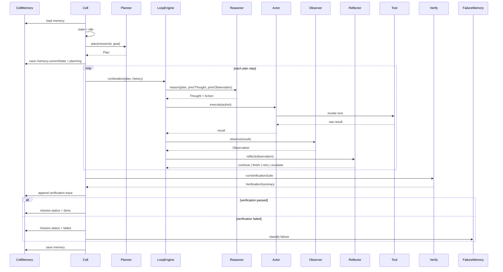
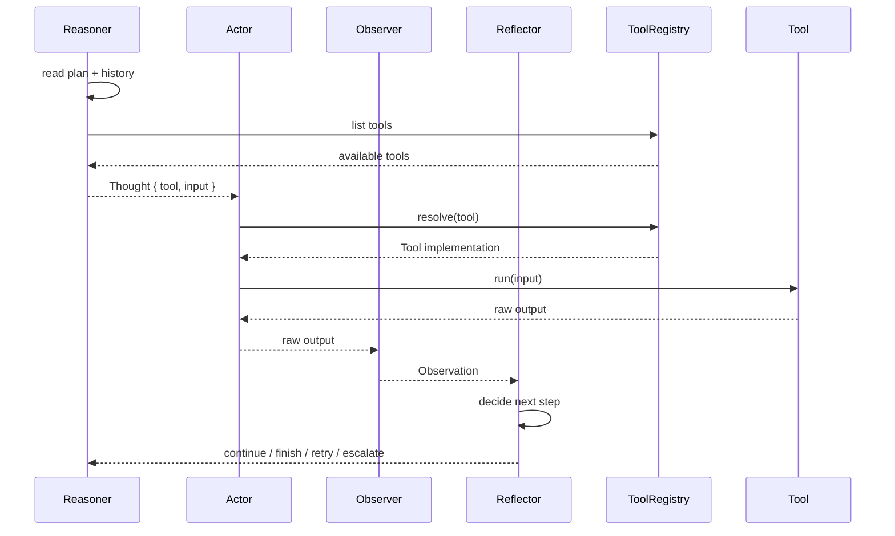
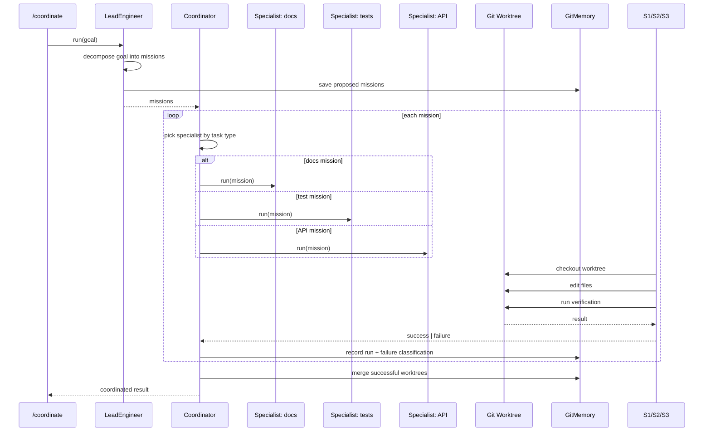
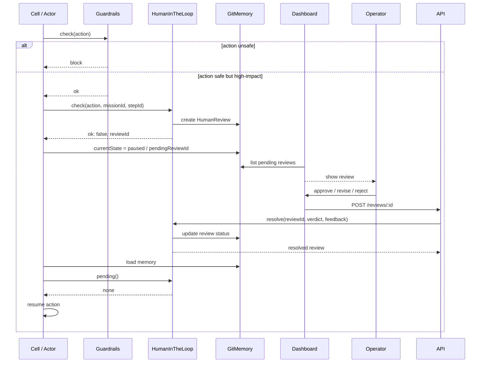
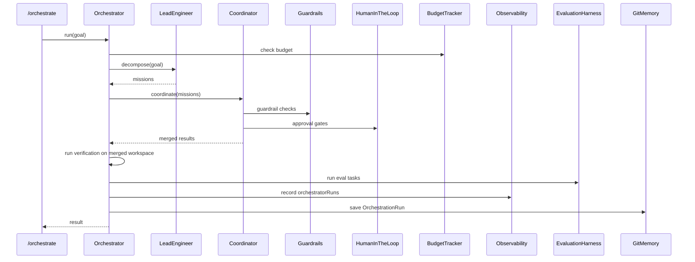
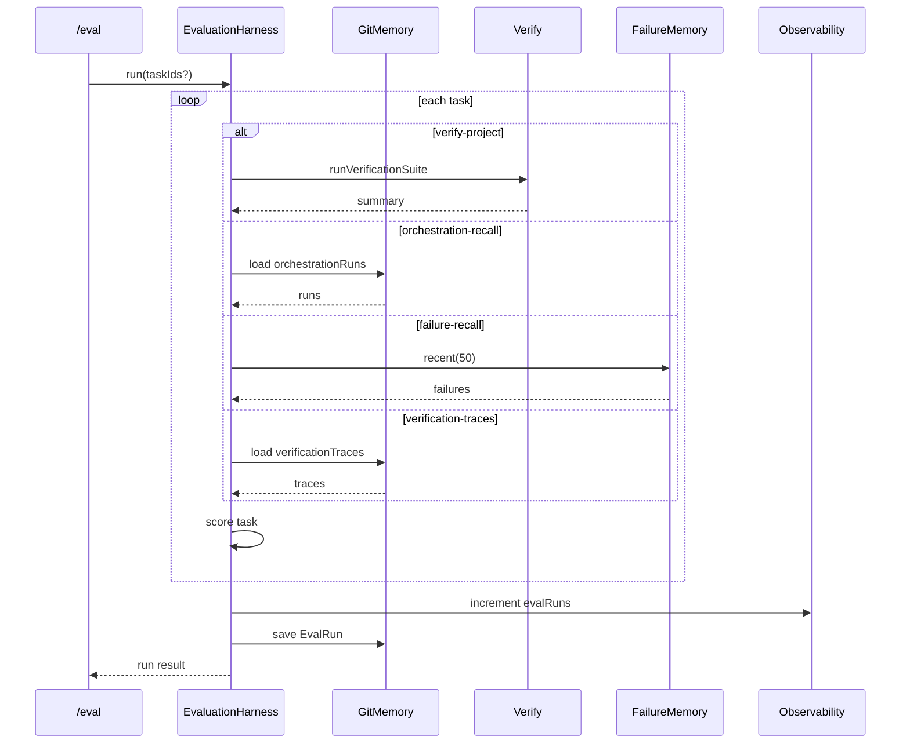
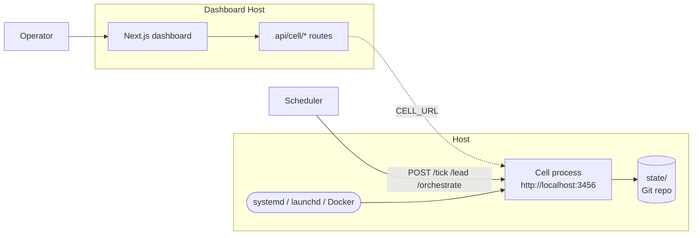
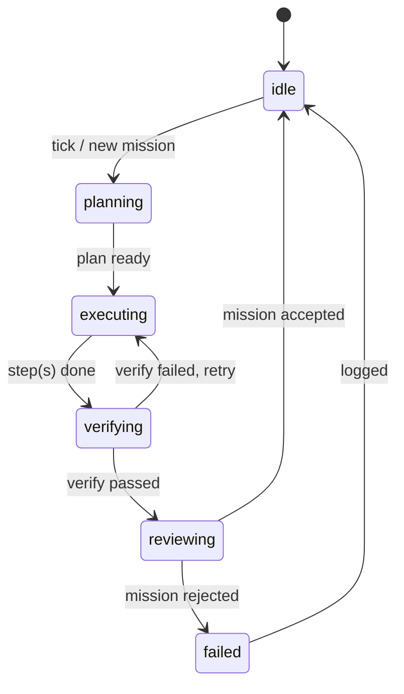
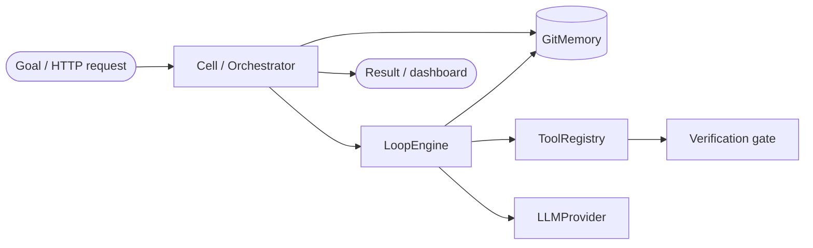

# Long-Running Cell — System Architecture

This document describes the high-level architecture of the agent cell built in the course. It is intended as a single reference for operators and contributors who need to understand how the pieces fit together without reading all 26 chapters.

## Component overview


## Single-mission cell loop

A mission moves through a durable state machine. Every state transition is persisted to Git memory, so a crash in the middle of any phase resumes cleanly.



## ReAct reasoning + tool use

The inner loop is a deterministic ReAct-style cycle. The reasoner picks a tool; the actor invokes it; the observer turns the raw result into a structured observation; the reflector decides whether to continue.



## Lead engineer → coordinator → specialists

A high-level goal is decomposed into missions by the lead engineer. The coordinator dispatches each mission to an appropriate specialist that works in an isolated Git worktree.



## Human-in-the-loop approval flow

High-impact actions pause the cell until a human approves, revises, or rejects. The review record is durable, so a restart mid-review does not lose the question.



## Orchestrator end-to-end pipeline

The capstone `/orchestrate` endpoint wires every subsystem into one durable pipeline.



## Evaluation harness

The harness turns durable memory records into benchmark scores. It does not mutate the workspace; it reads what the cell has already done.



## Deployment architecture

The cell and dashboard are separate deployables. The cell is a stateful Node process with a small HTTP API. The dashboard is a stateless Next.js app that proxies the cell through `CELL_URL`.



## Key source map

| Concern | Primary file(s) |
|--------|----------------|
| State machine + mission lifecycle | `cell/src/cell.ts` |
| Git-backed durable memory | `cell/src/git-memory.ts`, `cell/src/memory-store.ts` |
| ReAct loop primitives | `cell/src/loop-engine.ts`, `cell/src/planner.ts`, `cell/src/reasoner.ts`, `cell/src/actor.ts`, `cell/src/observer.ts`, `cell/src/reflector.ts` |
| Tools | `cell/src/tools.ts` |
| Verification gate | `cell/src/verify.ts` |
| Lead engineer / decomposition | `cell/src/lead.ts` |
| Coordination + specialists | `cell/src/coordinator.ts`, `cell/src/specialist.ts`, `cell/src/worktree.ts` |
| Failure learning | `cell/src/git-memory.ts` (FailureMemory) |
| Memory retrieval | `cell/src/memory-store.ts` |
| Summarisation | `cell/src/summary.ts` |
| Scheduling | `cell/src/scheduler.ts` |
| Safety | `cell/src/guardrails.ts` |
| Human oversight | `cell/src/hitl.ts` |
| Budget + metrics | `cell/src/budget.ts`, `cell/src/observability.ts` |
| Orchestrator | `cell/src/orchestrator.ts` |
| Evaluation | `cell/src/eval.ts` |
| HTTP API | `cell/src/server.ts` |
| Dashboard | `frontend/src/app/page.tsx`, `frontend/src/components/*` |
| Deployment | `Dockerfile`, `docker-compose.yml`, `cell/scripts/*.plist` |

## Design patterns used (plain language)

If you are new to design patterns, do not worry about the fancy names. Each section below answers three questions:

1. **What problem does it solve?**
2. **What does the code actually look like?**
3. **Where do I read more?**

Every snippet is simplified from the real source to highlight the shape of the pattern.

### State pattern — the cell is always in exactly one state

**Problem:** Without clear states, the cell could try to verify a mission before running it, or run two missions at once.

**Solution:** `CellState` is a fixed list of strings. The cell can only transition in allowed ways.

```ts
// cell/src/types.ts
export type CellState = 'idle' | 'planning' | 'executing' | 'verifying' | 'reviewing' | 'paused';

// cell/src/cell.ts
async function tick() {
  const memory = await this.memory.load();
  if (memory.currentState === 'idle') {
    await this.planMission();
    memory.currentState = 'planning';
  } else if (memory.currentState === 'planning') {
    await this.executePlan();
    memory.currentState = 'executing';
  }
  // ...
  await this.memory.save(memory);
}
```

**Why it matters:** Because the state is saved to Git memory after every change, a crash mid-mission resumes from the exact same state.

- Chapter: 03 — The durable cell loop
- File: `cell/src/cell.ts`, `cell/src/types.ts`

### Registry pattern — looking up tools by name

**Problem:** Tools (`read_file`, `edit_file`, `shell`) are scattered. The actor should not hard-code every tool.

**Solution:** Register tools under string names, then look them up at runtime.

```ts
// cell/src/tools.ts
export class ToolRegistryImpl implements ToolRegistry {
  private tools = new Map<string, Tool>();

  register(tool: Tool) {
    this.tools.set(tool.name, tool);
  }

  resolve(name: string): Tool | undefined {
    return this.tools.get(name);
  }
}

// cell/src/actor.ts
async act(thought: Thought) {
  const tool = this.registry.resolve(thought.action.tool);
  if (!tool) throw new Error(`Unknown tool: ${thought.action.tool}`);
  return await tool.execute(thought.action.input);
}
```

**Why it matters:** Adding a new tool is a one-line `registry.register(new MyTool())`. Nothing else in the cell changes.

- Chapter: 09 — ReAct: Reasoning + Tool Use
- File: `cell/src/tools.ts`, `cell/src/actor.ts`

### Strategy pattern — picking the right runner for the job

**Problem:** A docs mission and a test mission need different behaviour, but the coordinator should treat them the same.

**Solution:** Each specialist implements the same interface, and the coordinator picks one based on the mission type.

```ts
// cell/src/specialist.ts
export interface Specialist {
  canHandle(mission: Mission): boolean;
  run(mission: Mission): Promise<MissionResult>;
}

export class DocsSpecialist implements Specialist {
  canHandle(mission) { return mission.taskType === 'docs'; }
  async run(mission) { /* update README, run docs lint */ }
}

// cell/src/coordinator.ts
const specialist = this.specialists.find((s) => s.canHandle(mission));
const result = await specialist.run(mission);
```

**Why it matters:** You can add a `SecuritySpecialist` later without touching the coordinator logic.

- Chapter: 15 — Specialist cells
- File: `cell/src/coordinator.ts`, `cell/src/specialist.ts`

### Repository pattern — durable storage as a service

**Problem:** Scattered file reads/writes make it hard to change how state is stored.

**Solution:** `GitMemory` hides the fact that state lives in `state/memory.json` inside a Git repo.

```ts
// cell/src/git-memory.ts
export class GitMemory {
  async load(): Promise<CellMemory> {
    const raw = await fs.readFile(this.memoryPath(), 'utf-8');
    return JSON.parse(raw);
  }

  async save(memory: CellMemory, commitMessage?: string): Promise<void> {
    await fs.writeFile(this.memoryPath(), JSON.stringify(memory, null, 2));
    this.gitCommit(commitMessage ?? 'checkpoint');
  }
}
```

**Why it matters:** The rest of the cell calls `memory.load()` and `memory.save()`. If you later switch to SQLite, only `GitMemory` changes.

- Chapter: 04 — Git as memory
- File: `cell/src/git-memory.ts`

### Observer pattern — collecting metrics without tangling code

**Problem:** Subsystems should record metrics without knowing about dashboards or databases.

**Solution:** A central `Observability` object receives counters. Subsystems emit; dashboards read.

```ts
// cell/src/observability.ts
export class Observability {
  async increment(counter: MetricCounter): Promise<void> {
    const snapshot = await this.load();
    snapshot[counter] = (snapshot[counter] ?? 0) + 1;
    await this.save(snapshot);
  }
}

// Anywhere in the cell
await this.observability.increment('missionsCompleted');
```

**Why it matters:** The cell does not need to know the dashboard exists. It just counts events.

- Chapter: 20 — Budget, cost, and observability
- File: `cell/src/observability.ts`

### Maker / checker pattern — one agent proposes, another verifies

**Problem:** A single agent can convince itself that bad code is good.

**Solution:** A `Maker` produces a change, then a separate `Checker` runs verification. Only passing changes are accepted.

```ts
// cell/src/network.ts (simplified)
async run(missionId: string, task: string) {
  for (let round = 1; round <= this.maxRounds; round++) {
    const makerResult = await this.maker.run(task, { missionId, round });
    const checkerResult = await this.checker.run('', {
      missionId,
      round,
      makerResult,
    });
    if (checkerResult.verdict === 'approve') {
      return { approved: true, result: makerResult };
    }
  }
  return { approved: false };
}
```

**Why it matters:** Creation and validation are separate. The checker can be stricter over time without changing the maker.

- Chapter: 11 — Maker / Checker Subagents
- File: `cell/src/network.ts`

### Coordinator / worker pattern — one dispatcher, many isolated workers

**Problem:** Parallel missions can overwrite each other’s files.

**Solution:** The coordinator gives each mission its own Git worktree. Work is isolated; only successful results are merged back.

```ts
// cell/src/coordinator.ts (simplified)
async coordinate(missions: Mission[]) {
  for (const mission of missions) {
    const worktree = await this.worktree.create(mission.id);
    const specialist = this.pickSpecialist(mission);
    const result = await specialist.run(mission, worktree.path);
    if (result.success) {
      await this.worktree.merge(worktree, mission.id);
    }
  }
}
```

**Why it matters:** A failing mission cannot corrupt the main workspace or other missions.

- Chapter: 13 — Multi-Loop Coordination
- File: `cell/src/coordinator.ts`, `cell/src/worktree.ts`

### Adapter / provider pattern — interchangeable backends

**Problem:** The cell should not be locked to one LLM vendor or memory store.

**Solution:** Define an interface; concrete providers implement it. The cell talks to the interface.

```ts
// cell/src/llm/types.ts
export interface LLMProvider {
  name: string;
  complete(options: { messages: LLMMessage[] }): Promise<LLMResponse>;
}

// cell/src/llm/ollama-provider.ts
export class OllamaProvider implements LLMProvider {
  name = 'ollama';
  async complete(options) {
    const res = await fetch(`${this.baseUrl}/api/chat`, { /* ... */ });
    return { text: /* parsed response */ };
  }
}

// cell/src/llm/factory.ts
export function createLLMProvider(config?: LLMProviderConfig): LLMProvider | undefined {
  if (!config || config.provider === 'none') return undefined;
  if (config.provider === 'ollama') return new OllamaProvider(config);
  if (config.provider === 'openai') return new OpenAIProvider(config);
  throw new Error(`Unknown LLM provider: ${config.provider}`);
}
```

**Why it matters:** You can switch from Ollama to OpenAI by changing one environment variable. The planner, reasoner, and lead engineer never change.

- Chapter: 08 / 14 (with LLM notes)
- Files: `cell/src/llm/types.ts`, `cell/src/llm/factory.ts`, `cell/src/llm/ollama-provider.ts`, `cell/src/llm/openai-provider.ts`

### Environment-driven configuration

**Problem:** Hard-coded API keys and model names make the course brittle.

**Solution:** `Cell` reads environment variables and creates an LLM provider only when configured.

```ts
// cell/src/cell.ts (simplified)
const llm = config.llm ?? createLLMProviderFromEnv();
this.planner = new Planner({ maxSteps: config.maxRetries, llm });
this.reasoner = new Reasoner(config.reasonerOptions, defaultRegistry, llm);
```

```bash
# Rule-based baseline (default)
LLM_PROVIDER=none npm run dev

# Local Ollama
LLM_PROVIDER=ollama LLM_MODEL=llama3.1 npm run dev

# OpenAI or OpenAI-compatible proxy
LLM_PROVIDER=openai LLM_API_KEY=sk-... LLM_MODEL=gpt-4o-mini npm run dev
```

Optional variables: `LLM_BASE_URL`, `LLM_TEMPERATURE`, `LLM_MAX_TOKENS`.

**Why it matters:** Students can run the entire course without an API key. One env var adds LLM intelligence; the rule-based paths remain as a fallback.

## State machine



## Data flow overview



## Where to read next

- `docs/FACTORY_MODES.md` explains lit vs dark factory concepts and how to configure the cell for either mode.
- `docs/DESIGN_PATTERNS.md` walks through every design pattern with class diagrams.
- `docs/SEQUENCE_DIAGRAMS.md` collects all sequence diagrams in one place.
- `docs/CLASS_DIAGRAMS.md` shows class diagrams for every major module.
- `docs/CODEBASE_GUIDE.md` is a junior-dev walkthrough of the whole codebase.
- `docs/DATA_FLOW.md` traces how data moves from request to dashboard.
- `docs/CHAPTER_CROSS_REFERENCE.md` maps each chapter to the files and concepts it teaches.
- `docs/TOC.md` shows the chapter-by-chapter path through the course.
- `chapters/01-cell-concepts/README.md` explains the core mental model.
