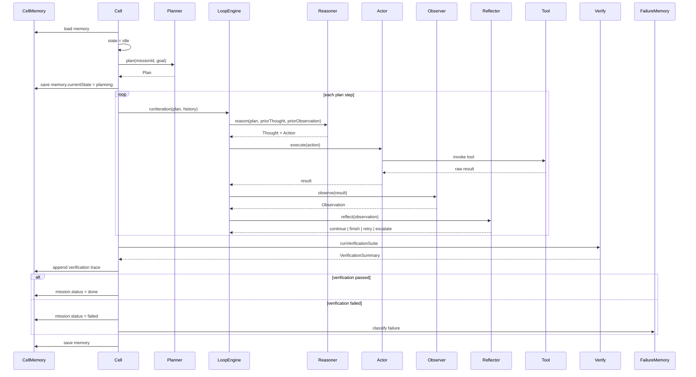
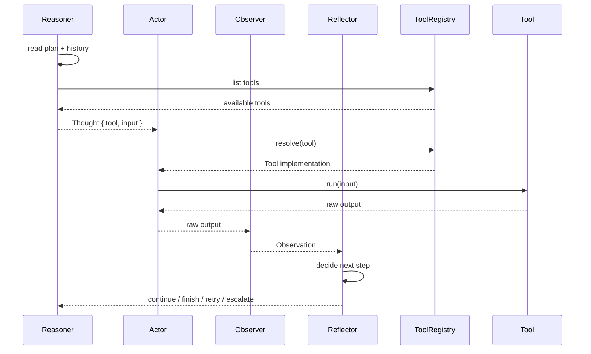
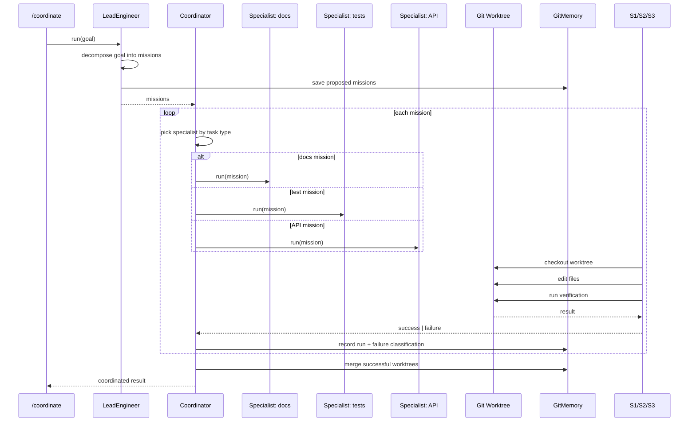
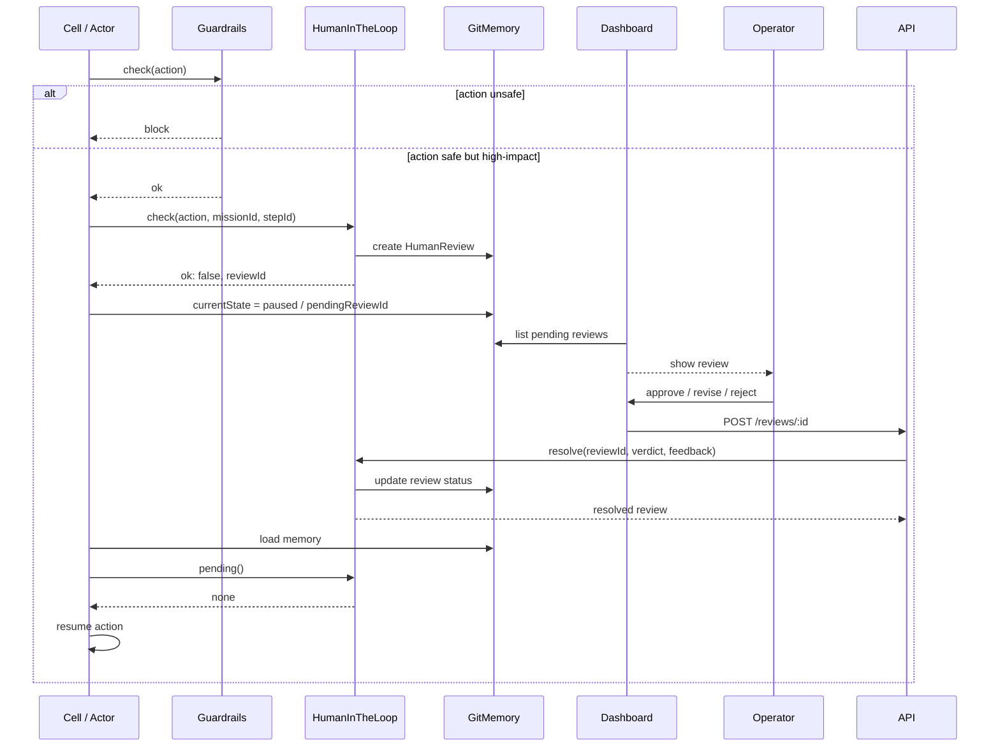
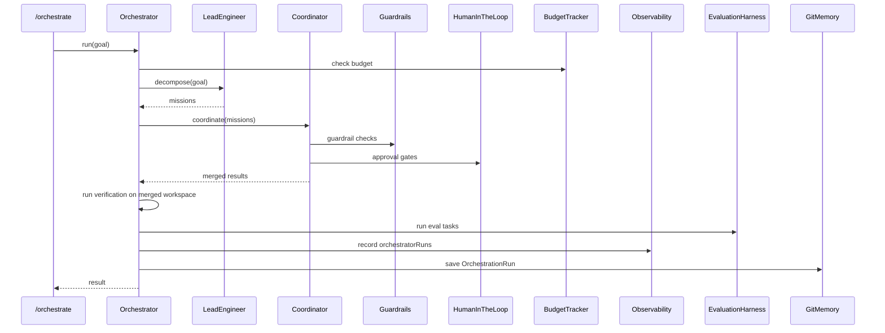
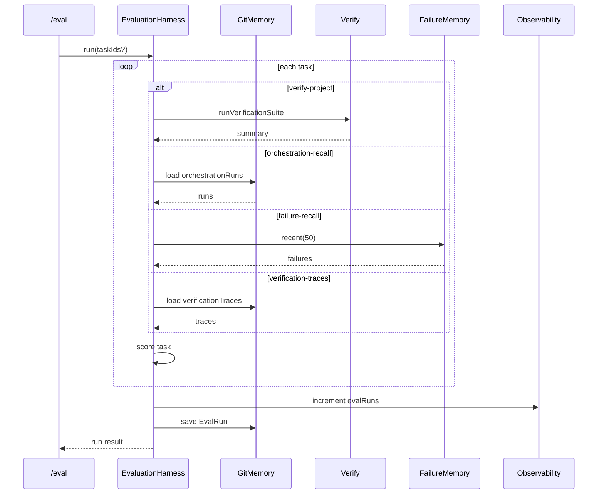

# Long-Running Cell — System Architecture

This document describes the high-level architecture of the agent cell built in the course. It is intended as a single reference for operators and contributors who need to understand how the pieces fit together without reading all 26 chapters.

## Component overview

## Single-mission cell loop

A mission moves through a durable state machine. Every state transition is persisted to Git memory, so a crash in the middle of any phase resumes cleanly.

## ReAct reasoning + tool use

The inner loop is a deterministic ReAct-style cycle. The reasoner picks a tool; the actor invokes it; the observer turns the raw result into a structured observation; the reflector decides whether to continue.

## Lead engineer → coordinator → specialists

A high-level goal is decomposed into missions by the lead engineer. The coordinator dispatches each mission to an appropriate specialist that works in an isolated Git worktree.

## Human-in-the-loop approval flow

High-impact actions pause the cell until a human approves, revises, or rejects. The review record is durable, so a restart mid-review does not lose the question.

## Orchestrator end-to-end pipeline

The capstone `/orchestrate` endpoint wires every subsystem into one durable pipeline.

## Evaluation harness

The harness turns durable memory records into benchmark scores. It does not mutate the workspace; it reads what the cell has already done.

## Deployment architecture

The cell and dashboard are separate deployables. The cell is a stateful Node process with a small HTTP API. The dashboard is a stateless Next.js app that proxies the cell through `CELL_URL`.

## Key source map

| Concern | Primary file(s) |
|--------|----------------|
| State machine + mission lifecycle | `cell/src/cell.ts` |
| Git-backed durable memory | `cell/src/git-memory.ts`, `cell/src/memory-store.ts` |
| ReAct loop primitives | `cell/src/loop-engine.ts`, `cell/src/planner.ts`, `cell/src/reasoner.ts`, `cell/src/actor.ts`, `cell/src/observer.ts`, `cell/src/reflector.ts` |
| Tools | `cell/src/tools.ts` |
| Verification gate | `cell/src/verify.ts` |
| Lead engineer / decomposition | `cell/src/lead.ts` |
| Coordination + specialists | `cell/src/coordinator.ts`, `cell/src/specialist.ts`, `cell/src/worktree.ts` |
| Failure learning | `cell/src/git-memory.ts` (FailureMemory) |
| Memory retrieval | `cell/src/memory-store.ts` |
| Summarisation | `cell/src/summary.ts` |
| Scheduling | `cell/src/scheduler.ts` |
| Safety | `cell/src/guardrails.ts` |
| Human oversight | `cell/src/hitl.ts` |
| Budget + metrics | `cell/src/budget.ts`, `cell/src/observability.ts` |
| Orchestrator | `cell/src/orchestrator.ts` |
| Evaluation | `cell/src/eval.ts` |
| HTTP API | `cell/src/server.ts` |
| Dashboard | `frontend/src/app/page.tsx`, `frontend/src/components/*` |
| Deployment | `Dockerfile`, `docker-compose.yml`, `cell/scripts/*.plist` |

## Design principles

1. **Durability before cleverness.** Every meaningful state change is written to Git-backed memory before the next step runs.
2. **Composition over monoliths.** The cell is built from small primitives (planner, actor, observer, reasoner, reflector) that are independently testable.
3. **Safety by default.** Guardrails, budgets, and human-in-the-loop gates sit between intent and execution.
4. **Observable by design.** Each subsystem emits metrics and records history so operators can compare performance across releases.
5. **Separate surface from core.** The dashboard is stateless and talks to the cell over HTTP; either can be deployed or restarted independently.
