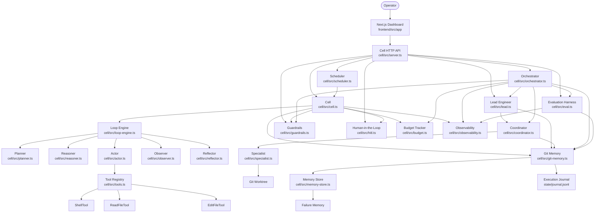
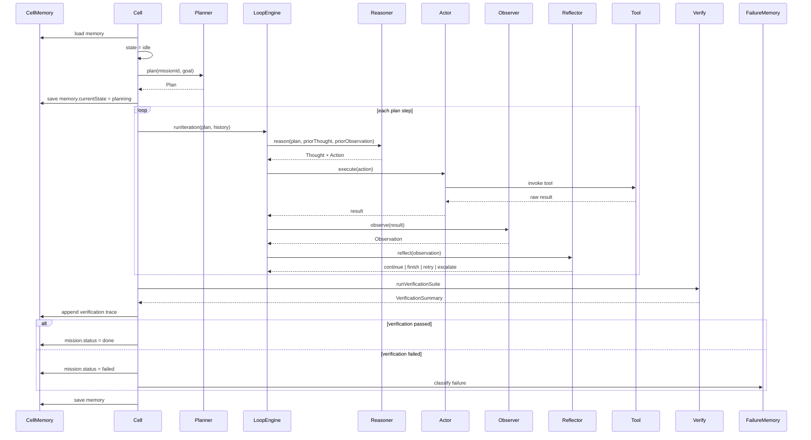
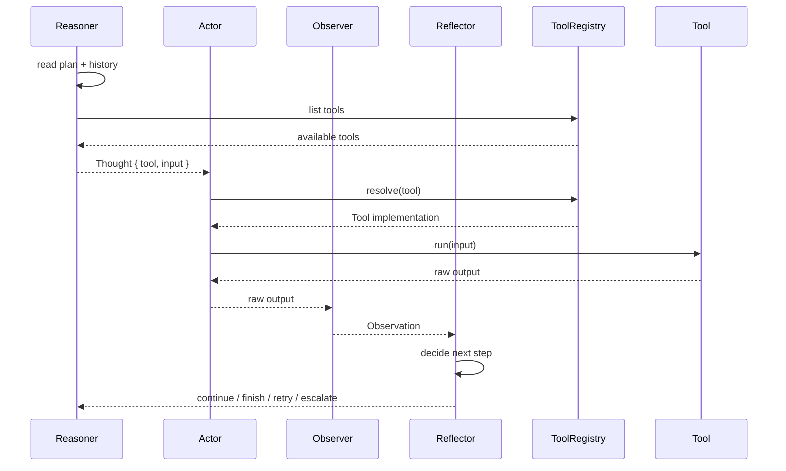
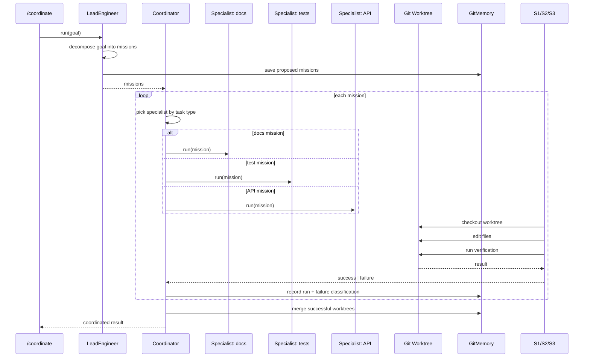
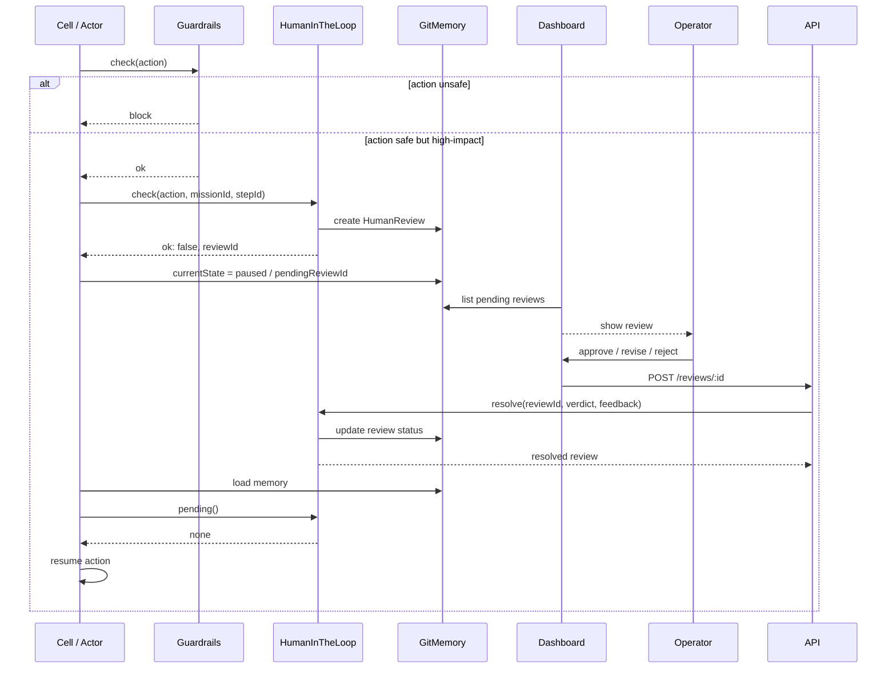
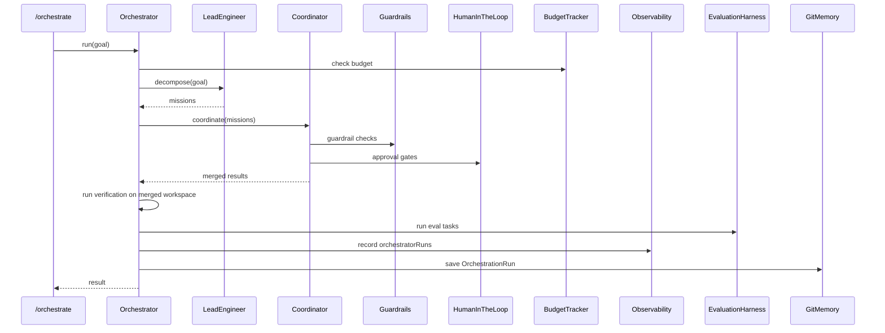
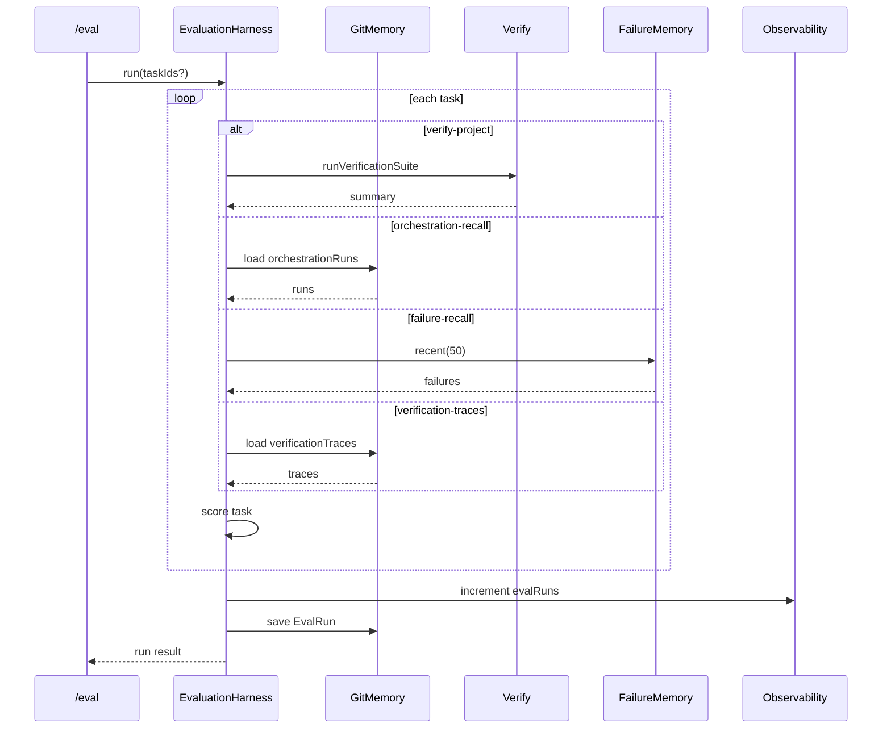
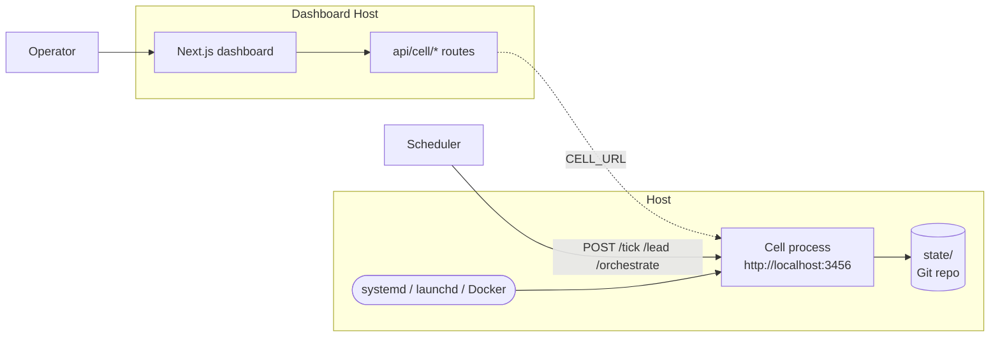
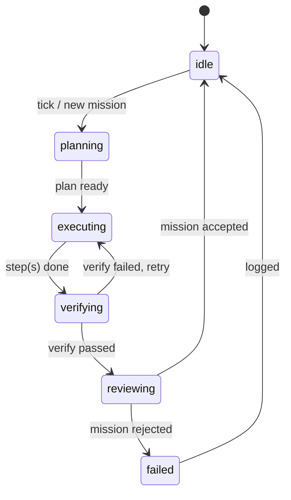

# Long-Running Cell — System Architecture

This document describes the high-level architecture of the agent cell built in the course. It is intended as a single reference for operators and contributors who need to understand how the pieces fit together without reading all 26 chapters.

## Component overview



## Single-mission cell loop

A mission moves through a durable state machine. Every state transition is persisted to Git memory, so a crash in the middle of any phase resumes cleanly.



## ReAct reasoning + tool use

The inner loop is a deterministic ReAct-style cycle. The reasoner picks a tool; the actor invokes it; the observer turns the raw result into a structured observation; the reflector decides whether to continue.



## Lead engineer → coordinator → specialists

A high-level goal is decomposed into missions by the lead engineer. The coordinator dispatches each mission to an appropriate specialist that works in an isolated Git worktree.



## Human-in-the-loop approval flow

High-impact actions pause the cell until a human approves, revises, or rejects. The review record is durable, so a restart mid-review does not lose the question.



## Orchestrator end-to-end pipeline

The capstone `/orchestrate` endpoint wires every subsystem into one durable pipeline.



## Evaluation harness

The harness turns durable memory records into benchmark scores. It does not mutate the workspace; it reads what the cell has already done.



## Deployment architecture

The cell and dashboard are separate deployables. The cell is a stateful Node process with a small HTTP API. The dashboard is a stateless Next.js app that proxies the cell through `CELL_URL`.



## Key source map

| Concern | Primary file(s) |
|--------|----------------|
| State machine + mission lifecycle | `cell/src/cell.ts` |
| Git-backed durable memory | `cell/src/git-memory.ts`, `cell/src/memory-store.ts` |
| ReAct loop primitives | `cell/src/loop-engine.ts`, `cell/src/planner.ts`, `cell/src/reasoner.ts`, `cell/src/actor.ts`, `cell/src/observer.ts`, `cell/src/reflector.ts` |
| Tools | `cell/src/tools.ts` |
| Verification gate | `cell/src/verify.ts` |
| Lead engineer / decomposition | `cell/src/lead.ts` |
| Coordination + specialists | `cell/src/coordinator.ts`, `cell/src/specialist.ts`, `cell/src/worktree.ts` |
| Failure learning | `cell/src/git-memory.ts` (FailureMemory) |
| Memory retrieval | `cell/src/memory-store.ts` |
| Summarisation | `cell/src/summary.ts` |
| Scheduling | `cell/src/scheduler.ts` |
| Safety | `cell/src/guardrails.ts` |
| Human oversight | `cell/src/hitl.ts` |
| Budget + metrics | `cell/src/budget.ts`, `cell/src/observability.ts` |
| Orchestrator | `cell/src/orchestrator.ts` |
| Evaluation | `cell/src/eval.ts` |
| HTTP API | `cell/src/server.ts` |
| Dashboard | `frontend/src/app/page.tsx`, `frontend/src/components/*` |
| Deployment | `Dockerfile`, `docker-compose.yml`, `cell/scripts/*.plist` |

## Design patterns used (plain language)

If you are not comfortable with design-pattern terminology, think of them as recurring "shapes" that keep the codebase organised.

### State pattern — the cell is always in one state

`Cell` uses `CellState = 'idle' | 'planning' | 'executing' | 'verifying' | 'reviewing'`. At any moment the cell is in exactly one of those states, and only certain transitions are allowed. This prevents the cell from trying to verify a mission it has not executed, or from running two missions at once in the same loop.

- File: `cell/src/cell.ts`
- Type: `cell/src/types.ts` (`CellState`)

### Registry pattern — looking up tools by name

A `ToolRegistry` stores tools under string names (`'read_file'`, `'edit_file'`, `'shell'`, `'verify'`). The `Actor` asks the registry for the tool by name and runs it. Adding a new tool does not require editing the actor; you register it once and every part of the system can use it.

- File: `cell/src/tools.ts`

### Strategy pattern — picking the right runner for the job

The `Coordinator` decides which `Specialist` should run a mission based on the mission type (`'docs'`, `'tests'`, `'api'`, `'code'`). Each specialist implements the same interface but behaves differently. This is the strategy pattern: same contract, interchangeable implementations.

- Files: `cell/src/coordinator.ts`, `cell/src/specialist.ts`

### Repository pattern — durable storage as a service

`GitMemory` hides the fact that state is stored in Git-backed JSON files. The rest of the code calls `memory.load()` and `memory.save(cell)` without knowing where the files live. If you later want to store state in SQLite or Postgres, you only change `GitMemory`, not the whole cell.

- File: `cell/src/git-memory.ts`

### Observer pattern — collecting metrics without tangling code

`Observability` exposes `increment(counter)` and `snapshot()`. Subsystems call `increment('missionsCompleted')` when something happens. The dashboard later reads the snapshot. The subsystems do not need to know about the dashboard; they just emit events.

- File: `cell/src/observability.ts`

### Maker / checker pattern — one agent proposes, another verifies

In the multi-loop chapter, a `Maker` produces a code change and a `Checker` runs verification on it. Only if the checker passes is the proposal accepted. This pattern separates creation from validation and catches mistakes before they reach memory.

- File: `cell/src/loop-engine.ts` / multi-loop code paths

### Coordinator / worker pattern — one dispatcher, many isolated workers

`Coordinator` takes a batch of missions and dispatches each one to a `Specialist` running in a separate Git worktree. The worktrees are isolated, so a failing mission cannot corrupt the main workspace.

- Files: `cell/src/coordinator.ts`, `cell/src/worktree.ts`

### Adapter / provider pattern — interchangeable backends

`ToolRegistry` already uses this idea: tools are looked up by name and can be swapped without changing the actor. The same pattern applies to LLM providers, embedding models, or different memory stores: the cell talks to an interface, not a concrete vendor.

The course keeps a rule-based baseline so it runs without API keys, but the architecture is ready for a provider implementation. `cell/src/llm/types.ts` defines the `LLMProvider` interface. Concrete providers live in `cell/src/llm/ollama-provider.ts` (local Ollama) and `cell/src/llm/openai-provider.ts` (OpenAI-compatible APIs, including proxies). `cell/src/llm/factory.ts` creates a provider from environment variables or returns `undefined` to keep the cell rule-based.

When a provider is configured, `Planner.plan`, `Reasoner.reason`, and `LeadEngineer.decompose` ask the LLM first and fall back to the existing rule-based paths if the response is unparseable. This means students can run the entire course locally, then flip one environment variable to add LLM intelligence without changing the cell logic.

- File: `cell/src/tools.ts` (registry), `cell/src/types.ts` (interfaces), `cell/src/llm/` (provider layer)

### Environment-driven configuration

The cell reads `LLM_PROVIDER` to decide whether to use an LLM and which vendor to call:

```bash
# Rule-based baseline (default)
LLM_PROVIDER=none npm run dev

# Local Ollama
LLM_PROVIDER=ollama LLM_MODEL=llama3.1 npm run dev

# OpenAI or OpenAI-compatible proxy
LLM_PROVIDER=openai LLM_API_KEY=sk-... LLM_MODEL=gpt-4o-mini npm run dev
```

Optional variables: `LLM_BASE_URL`, `LLM_TEMPERATURE`, `LLM_MAX_TOKENS`.

## State machine



## Data flow overview


