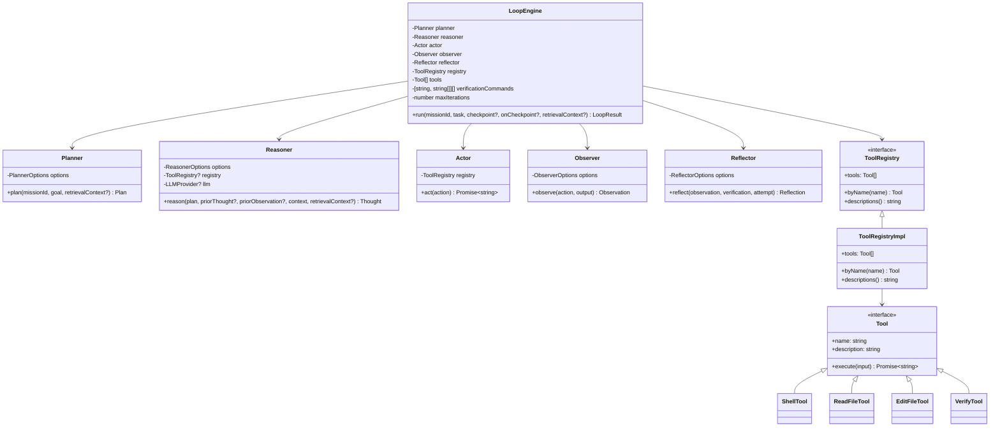
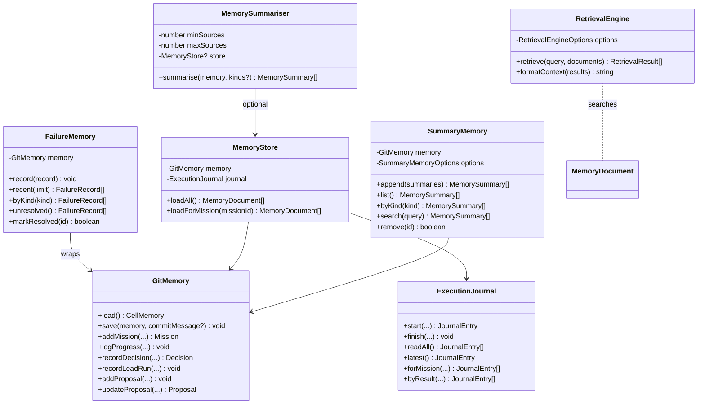
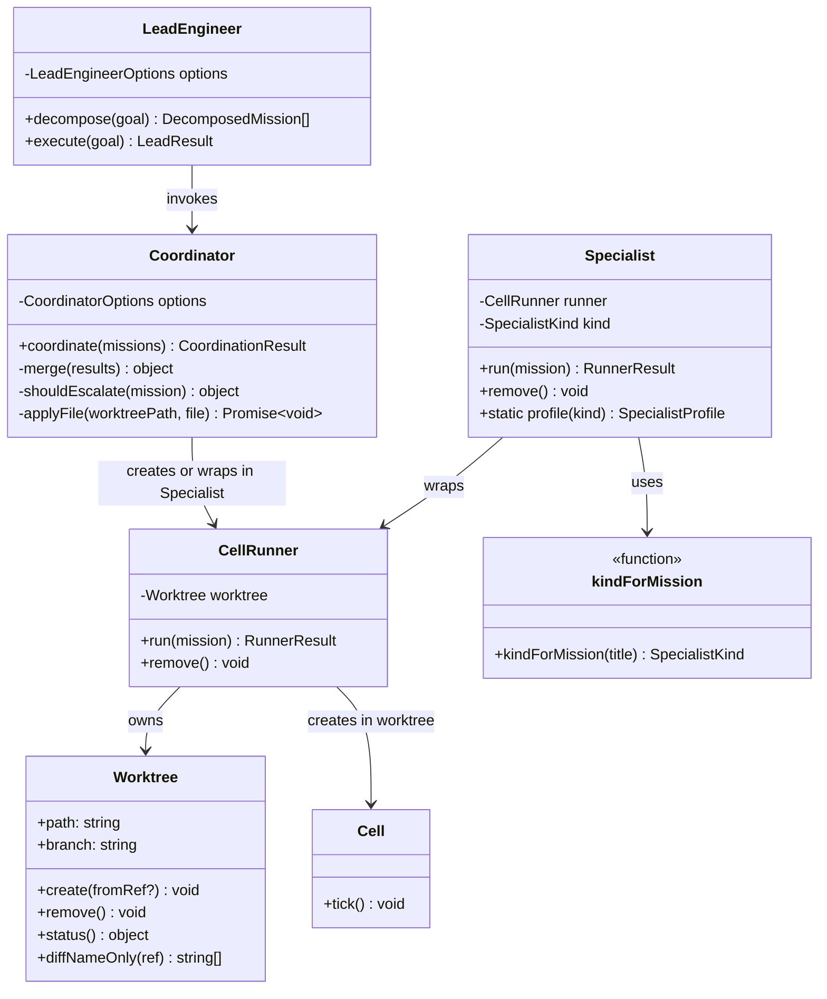
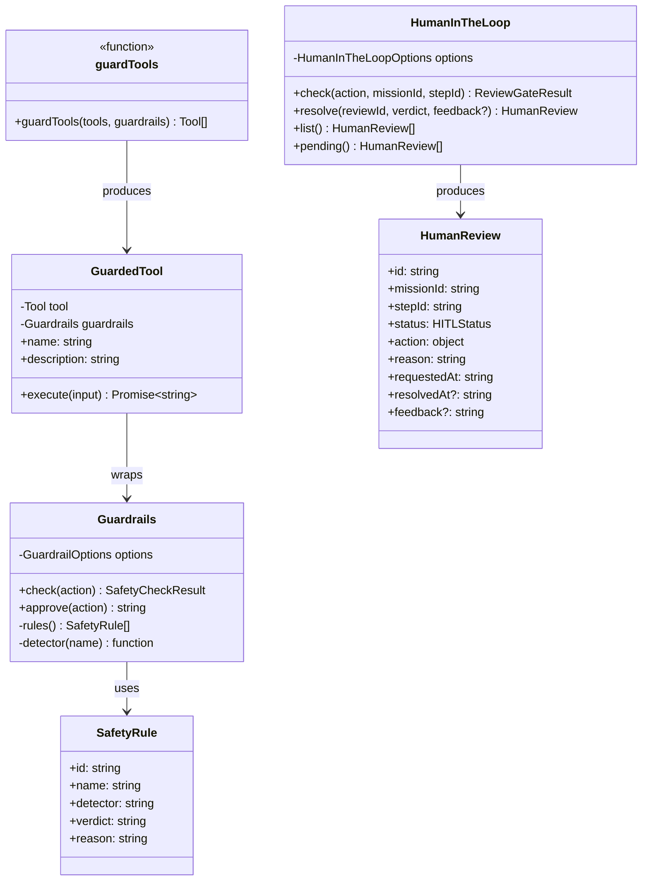
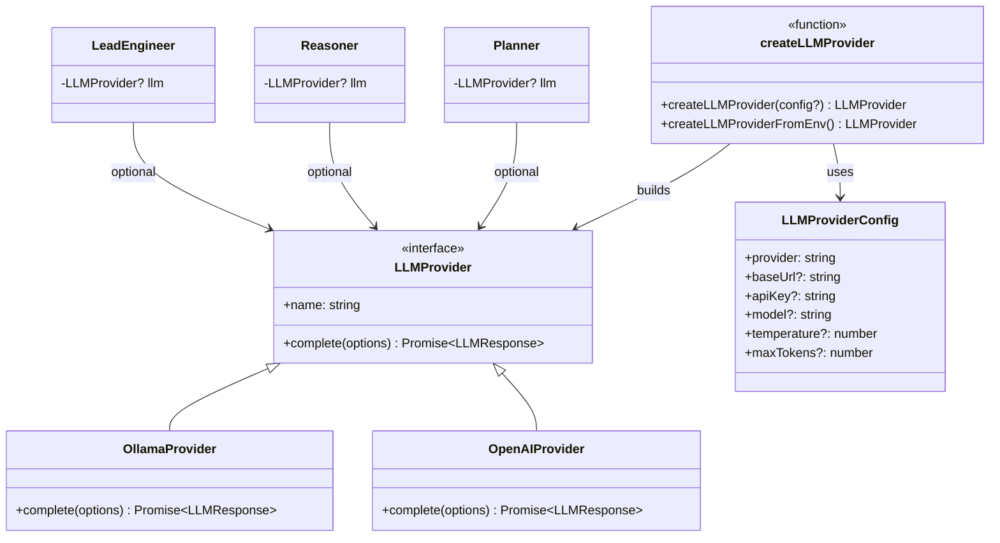
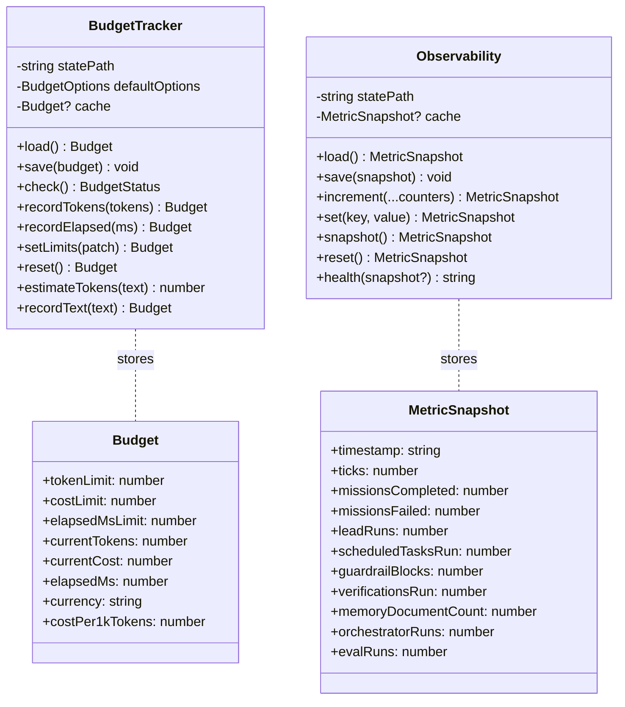
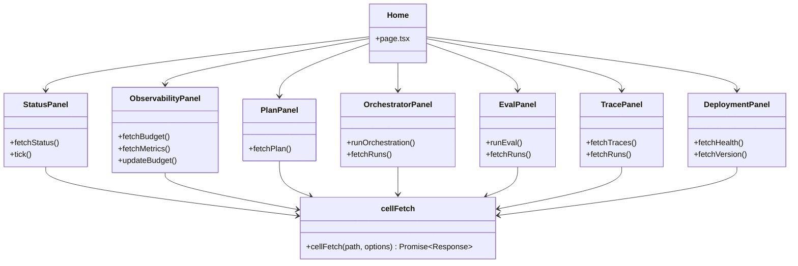

# Class Diagrams

This file shows the main classes and interfaces in `~/Downloads/projects/build-long-running-cell/` as Mermaid class diagrams. Each diagram focuses on one layer so the relationships stay readable.

> **How to read these diagrams:** A box is a class or interface. An arrow with a hollow triangle means "is a" (inheritance / implements). A plain arrow means "uses" or "has a". A plus sign (`+`) means public, a minus sign (`-`) means private.

---

## 1. Cell + Its Dependencies

`Cell` is the main state machine. It owns memory, the journal, the loop engine, the planner, and the safety/budget/observability helpers.

```mermaid
classDiagram
    class Cell {
        -GitMemory memory
        -ExecutionJournal journal
        -LoopEngine loopEngine
        -Planner planner
        -Reasoner reasoner
        -Reflector reflector
        -MemoryStore memoryStore
        -RetrievalEngine retrieval
        -BudgetTracker budget
        -Observability observability
        -HumanInTheLoop hitl
        -CellConfig config
        +constructor(config: CellConfig)
        +state() CellState
        +currentMission() Mission
        +queueMission(title, description) Mission
        +tick() void
        +resume(missionId?) JournalEntry
        +runs(result?) JournalEntry[]
        +verificationTraces() VerificationTrace[]
        +budgetStatus() BudgetStatus
        +metrics() MetricSnapshot
        -runPhase(mission, state, fn) void
        -recordVerificationTrace(...) void
    }

    class CellConfig {
        +basePath: string
        +verificationCommands: [string, string[]][]
        +maxRetries: number
        +tools?: Tool[]
        +shellAllowList?: string[]
        +reasoner?: Reasoner
        +reflector?: Reflector
        +retrieval?: RetrievalEngine
        +memoryStore?: MemoryStore
        +guardrails?: GuardrailOptions
        +budget?: BudgetTracker
        +observability?: Observability
        +llm?: LLMProvider
        +hitl?: HumanInTheLoop
    }

    class GitMemory {
        +load() CellMemory
        +save(memory, commitMessage?) void
        +addMission(title, description) Mission
        +logProgress(message) void
        +recordDecision(context, choice, reason) Decision
        +recordLeadRun(run) void
        +addProposal(proposal) void
        +updateProposal(id, patch) Proposal
    }

    class ExecutionJournal {
        +start(missionId, state) JournalEntry
        +finish(runId, result, note?) void
        +readAll() JournalEntry[]
        +latest() JournalEntry
        +forMission(missionId) JournalEntry[]
        +byResult(result) JournalEntry[]
    }

    class LoopEngine {
        +run(...) LoopResult
    }

    class Planner {
        +plan(missionId, goal, retrievalContext?) Plan
    }

    class Reasoner {
        +reason(plan, priorThought?, priorObservation?, context, retrievalContext?) Thought
    }

    class Reflector {
        +reflect(observation, verification, attempt) Reflection
    }

    class BudgetTracker {
        +check() BudgetStatus
        +recordElapsed(ms) Budget
        +recordTokens(tokens) Budget
        +setLimits(patch) Budget
        +reset() Budget
    }

    class Observability {
        +increment(...counters) MetricSnapshot
        +snapshot() MetricSnapshot
        +health(snapshot?) string
    }

    class HumanInTheLoop {
        +check(action, missionId, stepId) ReviewGateResult
        +resolve(reviewId, verdict, feedback?) HumanReview
        +list() HumanReview[]
        +pending() HumanReview[]
    }

    Cell --> CellConfig : configured by
    Cell --> GitMemory : owns
    Cell --> ExecutionJournal : owns
    Cell --> LoopEngine : owns
    Cell --> Planner : owns
    Cell --> Reasoner : owns
    Cell --> Reflector : owns
    Cell --> MemoryStore : owns
    Cell --> RetrievalEngine : owns
    Cell --> BudgetTracker : owns
    Cell --> Observability : owns
    Cell --> HumanInTheLoop : owns
```

---

## 2. LoopEngine + Primitives

The ReAct loop is built from small, single-purpose primitives. Each primitive is easy to test and replace.

---

## 3. Memory Layer

The memory layer is a family of repositories. `GitMemory` is the ground truth. `ExecutionJournal` records phase runs. `MemoryStore` unifies them into searchable documents. `MemorySummariser` and `SummaryMemory` compress long histories.

---

## 4. Multi-Agent Layer

This layer splits big goals into parallel missions, runs them in isolated worktrees, and merges the results.

---

## 5. Safety Layer

Guardrails check every action before it runs. Human-in-the-loop adds an approval gate for sensitive actions.

---

## 6. LLM Layer

The LLM layer is optional. The cell works perfectly without it, but you can plug in Ollama or OpenAI if you want non-deterministic reasoning.

---

## 7. Observability / Budget

Budget and observability are independent services that track cost and health. They store state in JSON files under `state/`.

---

## 8. Dashboard Components (Frontend)

The dashboard is a Next.js app that polls the cell server through frontend API routes.

