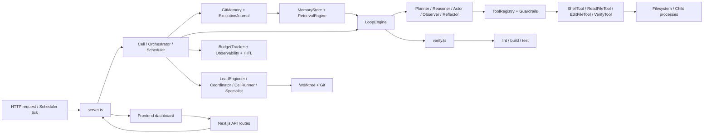
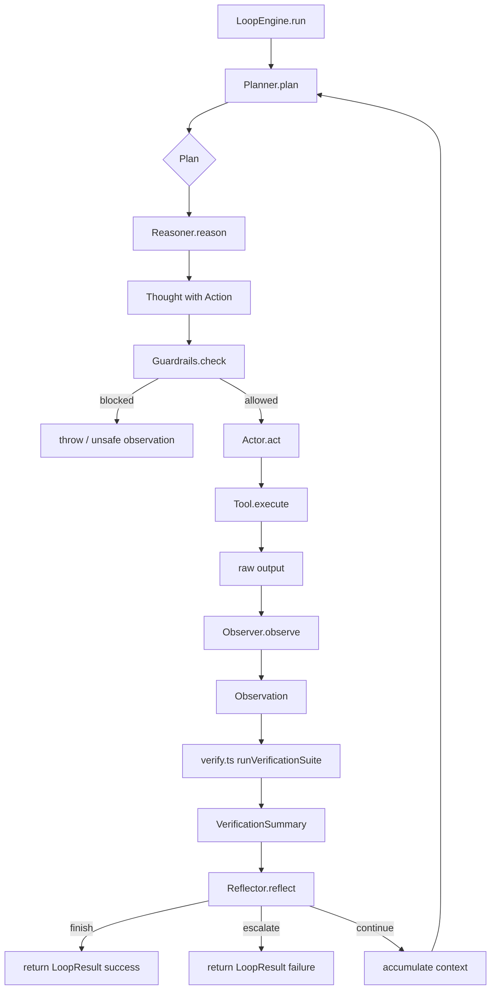
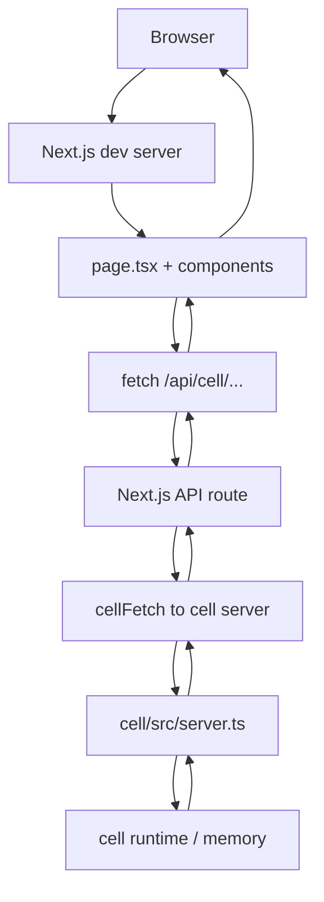
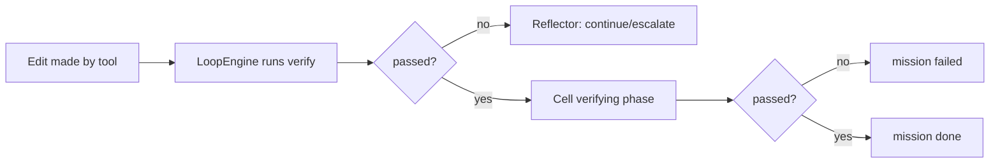
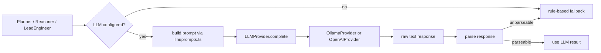

# Data Flow

This document explains how data moves through `~/Downloads/projects/build-long-running-cell/`, from an HTTP request or scheduler tick all the way through Cell → memory → loop → tools → verification → dashboard. It includes diagrams and per-file responsibility.

> **Analogy:** Think of the cell as a restaurant. The dashboard is the customer. The server (`server.ts`) takes the order. The cell is the kitchen. Memory is the recipe book and order log. The loop is the cook. Tools are the utensils. Verification is the taste test before the plate leaves the kitchen.

---

## 1. The Big Picture



---

## 2. Entry Points: HTTP Request vs Scheduler Tick

### HTTP request flow

A request comes into `cell/src/server.ts`. The server routes it to one of three destinations:

1. **Cell methods** — `tick`, `queueMission`, `state`, `currentMission`, `resume`, `runs`, `verificationTraces`.
2. **Standalone utilities** — `/plan`, `/reason`, `/reflect`, `/tool`, `/observe`, `/guardrails/*`, `/memory`, `/failures`, `/summaries`, `/reviews/*`, `/budget`, `/metrics`, `/health`, `/version`, `/status`, `/verify`.
3. **High-level orchestration** — `/lead`, `/coordinate`, `/coordinate-server`, `/orchestrate`, `/eval`, `/schedule`, `/tasks/*`, `/traces`.

### Scheduler tick flow

The scheduler (`cell/src/scheduler.ts`) is invoked by an external loop. It reads `state/scheduler.json`, finds due tasks, and dispatches them:

- `action: 'mission'` → `GitMemory.addMission()`
- `action: 'lead'` → `LeadEngineer.execute()`
- `action: 'orchestrate'` → `Orchestrator.run()`
- `action: 'verify'` → `runVerificationSuite()`

Both flows converge on the cell runtime and durable memory.

---

## 3. Per-File Responsibility

| File | Responsibility in data flow |
|---|---|
| `cell/src/server.ts` | Receives HTTP requests, builds objects, routes to cell/orchestrator/scheduler. |
| `cell/src/main.ts` | Wires shared budget, observability, and cell; starts server and optional auto-tick/scheduler loops. |
| `cell/src/cell.ts` | Loads memory, dispatches state machine, persists memory, journals phases, checks budget and HITL. |
| `cell/src/loop-engine.ts` | Runs the ReAct loop: plan → reason → act → observe → reflect → verify. |
| `cell/src/planner.ts` | Produces a `Plan` from a goal + optional retrieval context. |
| `cell/src/reasoner.ts` | Produces a `Thought` containing the next `Action`. |
| `cell/src/actor.ts` | Executes the tool named by the action. |
| `cell/src/observer.ts` | Converts raw tool output into an `Observation`. |
| `cell/src/reflector.ts` | Returns a `Reflection` verdict. |
| `cell/src/tools.ts` | Implements tools and the registry. |
| `cell/src/guardrails.ts` | Wraps tools with safety checks. |
| `cell/src/verify.ts` | Runs the verification gate and returns a summary. |
| `cell/src/git-memory.ts` | Loads/saves `CellMemory` as a Git-committed JSON file. |
| `cell/src/journal.ts` | Appends and updates phase-run records. |
| `cell/src/memory-store.ts` | Unifies memory + journal into `MemoryDocument[]`. |
| `cell/src/retrieval.ts` | Scores documents by keyword overlap. |
| `cell/src/lead.ts` | Decomposes a goal and runs missions through a coordinator. |
| `cell/src/coordinator.ts` | Runs missions in parallel batches and merges changed files. |
| `cell/src/runner.ts` | Runs one mission in a worktree. |
| `cell/src/specialist.ts` | Configures a runner for a specific mission kind. |
| `cell/src/worktree.ts` | Creates/removes Git worktrees. |
| `cell/src/hitl.ts` | Decides when actions need human approval and stores reviews. |
| `cell/src/budget.ts` | Tracks token/cost/runtime consumption. |
| `cell/src/observability.ts` | Tracks counters and health. |
| `cell/src/orchestrator.ts` | Runs the full decompose → coordinate → verify → summarise flow. |
| `cell/src/eval.ts` | Runs benchmark tasks and scores the cell. |
| `cell/src/scheduler.ts` | Stores cron tasks and dispatches them. |
| `cell/src/summary.ts` | Compresses memory into summaries. |
| `cell/src/failure.ts` | Classifies failure text into kinds and recovery strategies. |
| `frontend/src/lib/cell.ts` | Builds URLs and fetches the cell server. |
| `frontend/src/app/api/cell/*/route.ts` | Next.js proxy routes. |
| `frontend/src/app/page.tsx` | Main dashboard UI that polls APIs. |
| `frontend/src/components/*.tsx` | Individual dashboard panels. |

---

## 4. Detailed Flow: Queueing a Mission from the Dashboard

### Step 1 — Dashboard to Next.js route

```textn
frontend/src/app/page.tsx
    |
    v
fetch('/api/cell/missions', { method: 'POST', body: { title, description } })
    |
    v
frontend/src/app/api/cell/missions/route.ts
    |
    v
cellFetch('/missions', { method: 'POST', ... })
```

### Step 2 — Next.js route to cell server

```textn
frontend/src/lib/cell.ts
    |
    v
POST http://localhost:3456/missions
    |
    v
cell/src/server.ts  →  /missions handler
    |
    v
cell.queueMission(title, description)
```

### Step 3 — Cell writes to durable memory

```textn
cell/src/cell.ts
    |
    v
GitMemory.addMission(title, description)
    |
    v
cell/src/git-memory.ts
    |
    v
load() → push Mission → save() → git commit
    |
    v
state/memory.json
```

### Step 4 — Dashboard polls status

```textn
frontend/src/components/StatusPanel.tsx
    |
    v
fetch('/api/cell/status')
    |
    v
cell/src/server.ts  →  /status handler
    |
    v
cell.state()  +  cell.currentMission()
    |
    v
GitMemory.load()
    |
    v
JSON response { state, mission }
```

---

## 5. Detailed Flow: Ticking the Cell

### Step 1 — Request arrives

```textn
Dashboard button  or  POST /tick  or  AUTO_TICK loop
    |
    v
cell/src/server.ts  →  /tick handler
    |
    v
cell.tick()
```

### Step 2 — Budget and memory check

```textn
cell/src/cell.ts
    |
    +-- BudgetTracker.check()  →  load state/budget.json
    |
    +-- GitMemory.load()  →  read state/memory.json
```

If the budget is exceeded, the cell sets `currentState = 'paused'` and returns early.

### Step 3 — Human review check

```textn
cell/src/cell.ts
    |
    +-- if mem.pendingReviewId
        |
        +-- HumanInTheLoop.list()  →  load state/reviews.json
        |
        +-- if approved: clear pendingReviewId, continue
        +-- if rejected/revised: mark mission failed, go idle
        +-- if pending: return (do nothing this tick)
```

### Step 4 — State machine dispatch

```textn
cell/src/cell.ts
    |
    +-- idle    → find backlog mission → state = planning
    +-- planning → plan() → state = executing
    +-- executing → LoopEngine.run() → state = verifying
    +-- verifying → runVerificationSuite() → state = reviewing
    +-- reviewing → close mission → state = idle
```

Each phase is wrapped by `runPhase()`, which journals the start and finish.

### Step 5 — Persist state

```textn
cell/src/cell.ts
    |
    v
GitMemory.save(mem, commitMessage)
    |
    v
cell/src/git-memory.ts  →  write state/memory.json + git commit
```

---

## 6. Detailed Flow: Inside the ReAct Loop

Once the cell is in the `executing` state, `LoopEngine.run()` is called.



Data transformations:

| Stage | Input | Output | File |
|---|---|---|---|
| Plan | goal, retrieval context | `Plan` | `planner.ts` |
| Reason | plan, prior thought/observation | `Thought` | `reasoner.ts` |
| Guard | `Action` | `SafetyCheckResult` | `guardrails.ts` |
| Act | `Action` | raw `string` | `actor.ts` + tools |
| Observe | raw output | `Observation` | `observer.ts` |
| Verify | commands | `VerificationSummary` | `verify.ts` |
| Reflect | observation, verification | `Reflection` | `reflector.ts` |

---

## 7. Detailed Flow: Multi-Agent Coordination

When the dashboard asks the lead engineer to decompose a goal, the data flows through the multi-agent layer.

```mermaid
flowchart LR
    A[Dashboard /POST /lead] --> B[server.ts]
    B --> C[LeadEngineer.execute]
    C --> D[decompose goal]
    D --> E[Mission[]]
    E --> F[Coordinator.coordinate]
    F --> G[for each batch]
    G --> H[Specialist / CellRunner]
    H --> I[Worktree.create]
    I --> J[Cell.tick loop]
    J --> K[changed files]
    K --> L[Coordinator.merge]
    L --> M[git checkout files to main workspace]
    M --> N[CoordinationResult]
    N --> C
    C --> O[GitMemory.recordLeadRun]
    C --> P[LeadResult to dashboard]
```

Key data structures:

- `DecomposedMission` — a goal piece with optional `dependsOn`.
- `Mission` — the durable work item.
- `RunnerResult` — success/failure, changed files, error.
- `CoordinationResult` — merged files, rejected conflicts, failed missions.
- `LeadRun` — persisted record of the whole run.

---

## 8. Detailed Flow: Orchestrator End-to-End

The orchestrator is the capstone. It wires lead engineer + coordinator + final verification + summarisation.

```mermaid
flowchart TD
    A[POST /orchestrate {goal}] --> B[Orchestrator.run]
    B --> C[append run {status: running}]
    B --> D[LeadEngineer.execute]
    D --> E[missions + coordination result]
    B --> F[update run with missions/merged/rejected/failed]
    B --> G[runVerificationSuite]
    G -->|fail| H[run.status = failed]
    G -->|pass| I[MemorySummariser.summarise]
    I --> J[SummaryMemory.append]
    J --> K[run.summary set]
    K --> L[run.status = done]
    L --> M[Observability.increment orchestratorRuns]
    M --> N[GitMemory.save]
    N --> O[return OrchestrationRun]
```

---

## 9. Memory and State Files

All durable data lives under `state/` in the running workspace. Each file has a specific owner:

| File | Owner | Purpose |
|---|---|---|
| `state/memory.json` | `GitMemory` | `CellMemory` — missions, plans, decisions, summaries, runs, traces. |
| `state/journal.jsonl` | `ExecutionJournal` | Append-mostly phase-run log. |
| `state/budget.json` | `BudgetTracker` | Token/cost/runtime budget and consumption. |
| `state/metrics.json` | `Observability` | Counter snapshot. |
| `state/reviews.json` | `HumanInTheLoop` | Pending and resolved human reviews. |
| `state/scheduler.json` | `Scheduler` | Cron tasks, in-flight list, last start time. |

The `state/` directory is also a Git repository. Every `GitMemory.save()` writes `memory.json` and commits it, giving the cell a recoverable history.

---

## 10. Dashboard Data Flow

The dashboard does not read files directly. It polls the cell server.



Most panels poll every 3–5 seconds:

- `StatusPanel` polls `/api/cell/status`.
- `ObservabilityPanel` polls `/api/cell/budget` and `/api/cell/metrics`.
- `OrchestratorPanel` polls `/api/cell/orchestrator/runs`.
- `EvalPanel` polls `/api/cell/eval/runs`.
- `TracePanel` polls `/api/cell/traces` and `/api/cell/eval/runs`.
- `DeploymentPanel` polls `/api/cell/health` and `/api/cell/version`.

---

## 11. Verification as the Bottleneck/Gate

No matter how data enters the system, it must pass verification before a mission is considered done.



The default verification commands are defined in `cell/src/main.ts` and `cell/src/server.ts`:

```ts
[
  ['npm', ['run', 'lint']],
  ['npm', ['run', 'build']],
  ['npm', ['test']],
]
```

Specialists can override these. For example, the `docs` specialist only checks that `README.md` exists.

---

## 12. LLM Data Flow (Optional)

The cell works without an LLM, but when one is configured it can improve plans, reasoning, and goal decomposition.



Environment variables that control the LLM:

- `LLM_PROVIDER` — `ollama`, `openai`, or unset/none.
- `LLM_BASE_URL`
- `LLM_API_KEY`
- `LLM_MODEL`
- `LLM_TEMPERATURE`
- `LLM_MAX_TOKENS`

---

## 13. Failure and Learning Data Flow

When a mission fails, the cell classifies the failure and stores it.

```mermaid
flowchart TD
    A[Mission fails in CellRunner] --> B[RunnerResult with error]
    B --> C[FailureClassifier.classify]
    C --> D[FailureRecord]
    D --> E[FailureMemory.record]
    E --> F[state/memory.json failures[]]
    F --> G[Coordinator checks unresolved failures]
    G -->|known unrecoverable| H[pre-fail mission before dispatch]
    G -->|unknown/recoverable| I[dispatch mission]
    I --> J[Reflector with failure-kind rules]
    J -->|continue| I
    J -->|escalate| K[mission failed]
```

Failure data is also surfaced in the dashboard via `/api/cell/failures`.

---

## 14. Summary of Data Transformations

| Layer | Raw input | Transformed output | Stored in |
|---|---|---|---|
| Dashboard request | User form data | JSON request | HTTP body |
| Server route | HTTP request | Method call / JSON response | `server.ts` |
| Cell state machine | `CellMemory` | Updated `CellMemory` | `state/memory.json` |
| LoopEngine | goal + context | `LoopResult` | `CellMemory` + journal |
| Tool execution | `Action` | raw output | stdout / filesystem |
| Observation | raw output | `Observation` | loop context |
| Verification | commands | `VerificationSummary` | loop context + traces |
| Reflection | observation + verification | `Reflection` | loop context |
| LeadEngineer | goal | `LeadResult` + `LeadRun` | `state/memory.json` |
| Coordinator | missions | `CoordinationResult` + merged files | main workspace + memory |
| Orchestrator | goal | `OrchestrationRun` | `state/memory.json` |
| EvaluationHarness | tasks | `EvalRun` | `state/memory.json` |
| Scheduler | cron + payload | `ScheduleResult[]` | `state/scheduler.json` |
| HumanInTheLoop | action | `HumanReview` | `state/reviews.json` |
| Summariser | memory | `MemorySummary[]` | `state/memory.json` |
| Retrieval | query + docs | ranked `RetrievalResult[]` | runtime context |
