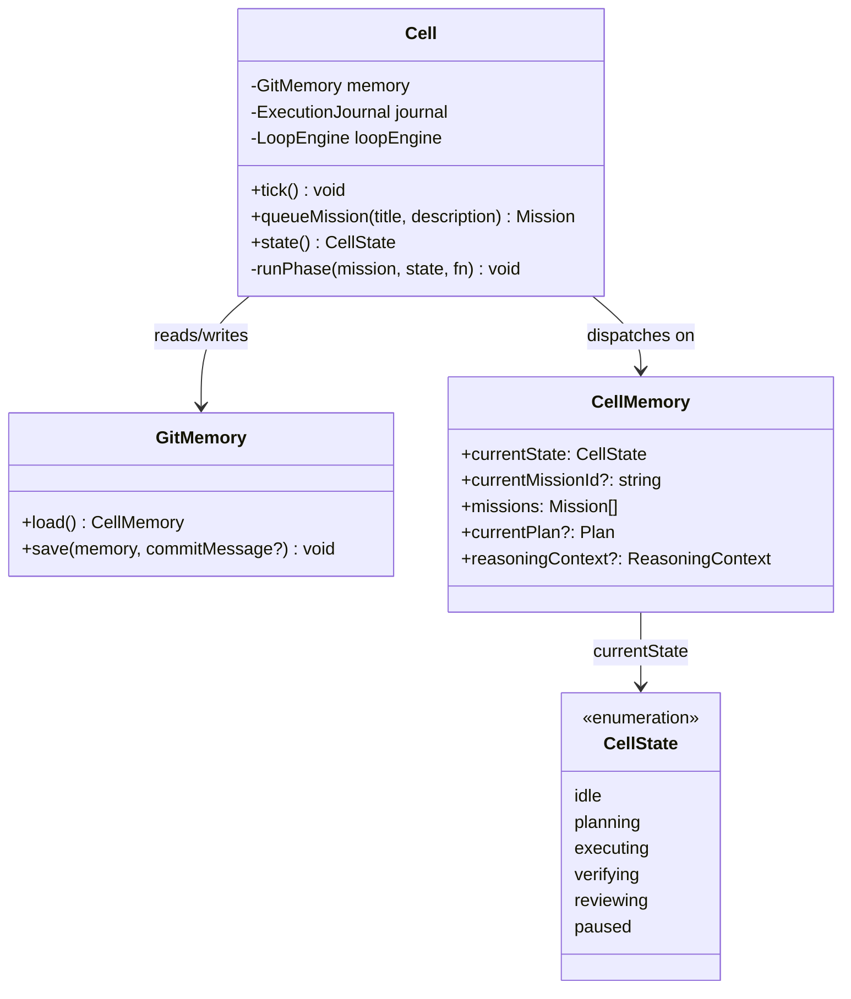
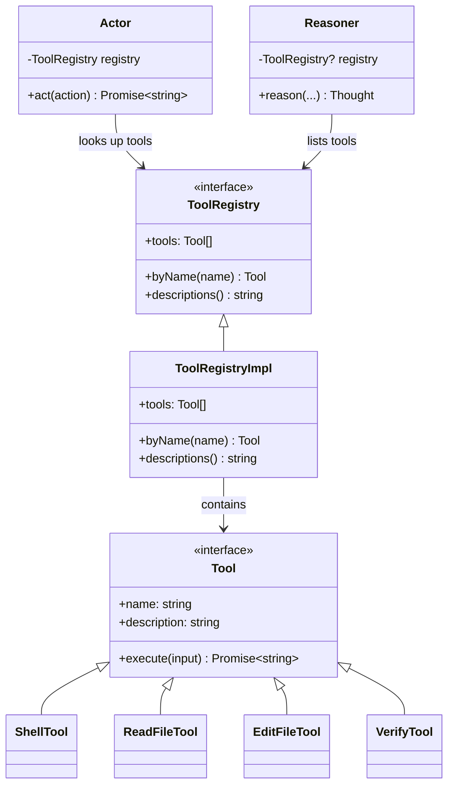
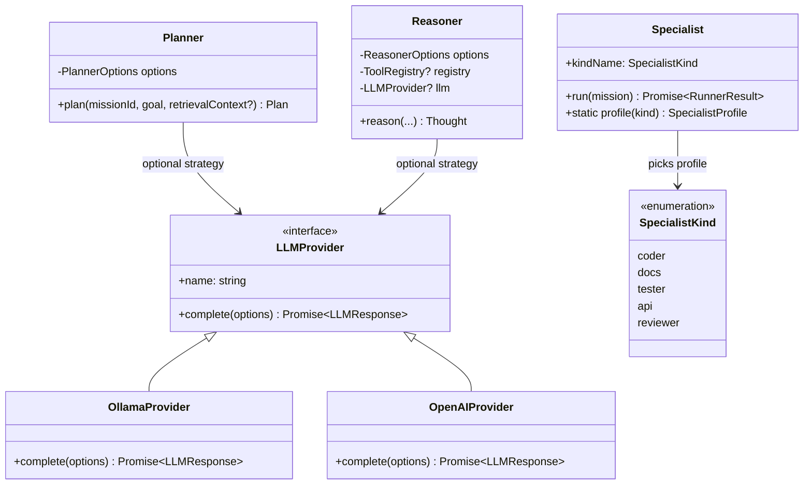
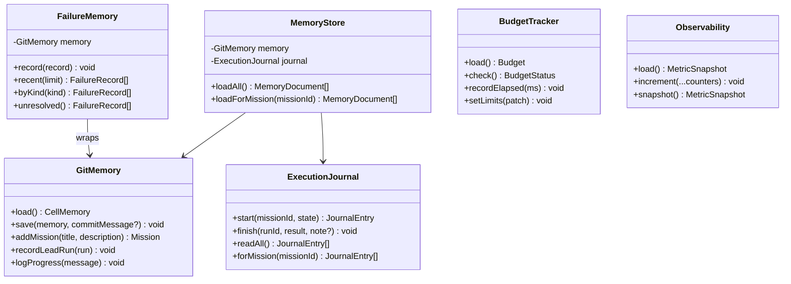
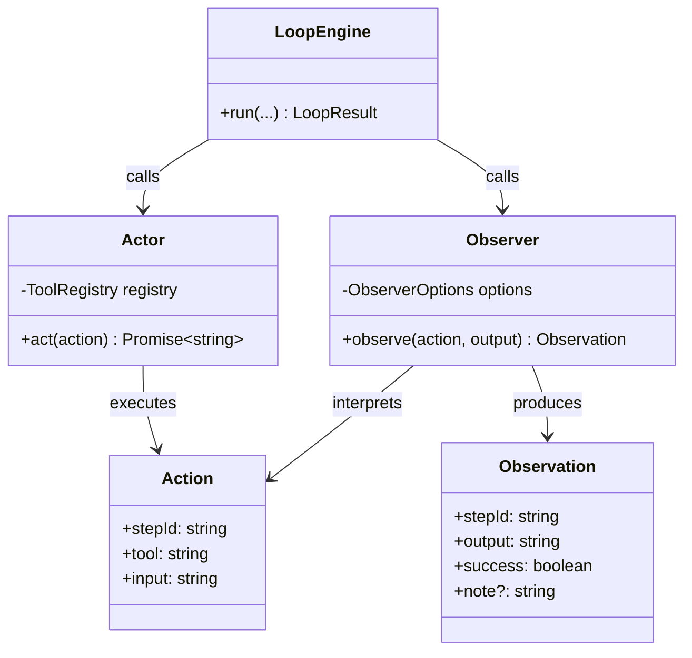
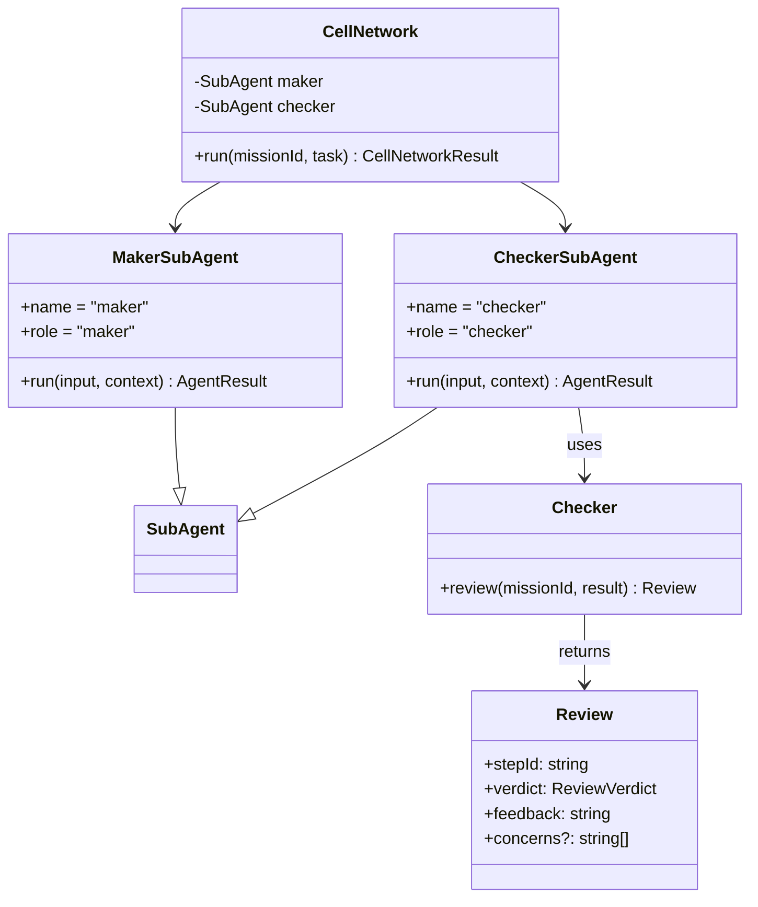
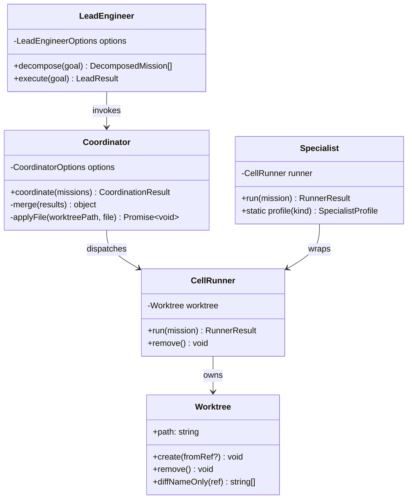
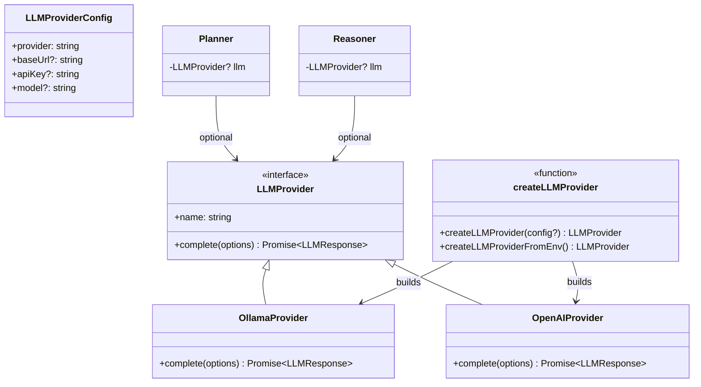
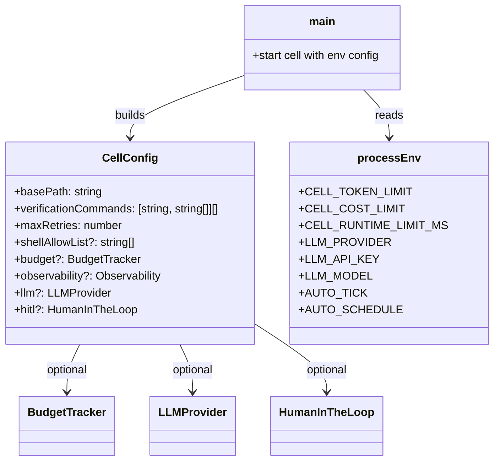

# Design Patterns in the Long-Running Cell

This guide explains every design pattern used in `~/Downloads/projects/build-long-running-cell/`, in plain language. For each pattern we describe the **problem it solves**, the **shape it takes in the code**, and a **Mermaid class diagram** so you can see the relationships at a glance.

> **One sentence summary:** The cell is a careful intern. It follows a checklist (state machine), uses the right tool for each job (registry + strategy), writes everything down (repository), watches what happens (observer), asks a second person before shipping (maker/checker), splits big projects between specialists (coordinator/worker), and can swap its brain in and out (adapter/provider) depending on environment variables.

---

## 1. State Pattern

### What problem it solves

A long-running cell is always doing exactly one thing at a time: waiting, planning, executing, verifying, reviewing, or paused. The **State Pattern** lets the `Cell` class behave differently in each phase without turning `tick()` into a giant `if/else` mess.

Think of a washing machine: it has states like *fill*, *wash*, *rinse*, *spin*. Each state does one thing and then transitions to the next. The cell works the same way.

### Code shape

- `cell/src/types.ts` defines the union type:

  ```ts
  export type CellState = 'idle' | 'planning' | 'executing' | 'verifying' | 'reviewing' | 'paused';
  ```

- `cell/src/cell.ts` stores `currentState` in `CellMemory` and dispatches with a `switch`:

  ```ts
  switch (mem.currentState) {
    case 'planning':  ...; mem.currentState = 'executing'; break;
    case 'executing': ...; mem.currentState = 'verifying';  break;
    case 'verifying': ...; mem.currentState = 'reviewing';  break;
    case 'reviewing': ...; mem.currentState = 'idle';      break;
  }
  ```

- Memory is saved **before** and **after** every phase so the cell resumes from the exact state it was in if the process crashes.

### Class diagram



---

## 2. Registry Pattern

### What problem it solves

Tools come and go: shell, read_file, edit_file, verify, maybe custom ones. The cell needs to look up a tool by name at runtime. The **Registry Pattern** keeps all tools in one catalog so the `Actor`, `Reasoner`, and dashboard can ask for them by name without hard-coding every possibility.

### Code shape

- `cell/src/types.ts` defines the contract:

  ```ts
  export interface ToolRegistry {
    tools: Tool[];
    byName(name: string): Tool | undefined;
    descriptions(): string;
  }
  ```

- `cell/src/tools.ts` implements `ToolRegistryImpl`:

  ```ts
  export class ToolRegistryImpl implements ToolRegistry {
    constructor(public readonly tools: Tool[] = []) {}
    byName(name: string) { return this.tools.find((t) => t.name === name); }
    descriptions() { return this.tools.map((t) => `- ${t.name}: ${t.description}`).join('\n'); }
  }
  ```

- `Cell` builds the registry in `cell.ts` and hands it to `LoopEngine`, `Actor`, and `Reasoner`.

### Class diagram



---

## 3. Strategy Pattern

### What problem it solves

Different situations need different algorithms. The cell can choose a planning strategy (rule-based vs LLM), a reasoning strategy, or even a specialist verification gate. The **Strategy Pattern** lets the caller swap the algorithm without changing the caller's code.

### Code shape

- `Planner.plan()` first tries an LLM if one is configured, otherwise falls back to keyword matching (`cell/src/planner.ts`).
- `Reasoner.reason()` does the same: LLM first, deterministic fallback (`cell/src/reasoner.ts`).
- `Specialist.profile()` returns different verification commands for `coder`, `docs`, `tester`, `api`, or `reviewer` (`cell/src/specialist.ts`).
- `createLLMProvider()` in `cell/src/llm/factory.ts` chooses `OllamaProvider` or `OpenAIProvider` based on environment variables.

### Class diagram



---

## 4. Repository Pattern

### What problem it solves

The cell needs durable storage for missions, decisions, failures, summaries, and more. The **Repository Pattern** hides the storage details (JSON files, Git commits, newline-delimited journal) behind clean interfaces. The rest of the code asks for *records*, not *files*.

### Code shape

- `GitMemory` in `cell/src/git-memory.ts` is the repository for `CellMemory`:

  ```ts
  export class GitMemory {
    async load(): Promise<CellMemory> { ... }
    async save(memory, commitMessage?) { ... }
    async addMission(title, description) { ... }
  }
  ```

- `ExecutionJournal` in `cell/src/journal.ts` is an append-mostly repository for phase runs:

  ```ts
  export class ExecutionJournal {
    async start(missionId, state) { ... }
    async finish(runId, result, note?) { ... }
    async readAll() { ... }
  }
  ```

- `FailureMemory` in `cell/src/git-memory.ts` wraps `GitMemory` to store `FailureRecord`s.
- `MemoryStore` in `cell/src/memory-store.ts` turns heterogeneous records into uniform `MemoryDocument`s for retrieval.
- `BudgetTracker` and `Observability` store `state/budget.json` and `state/metrics.json` respectively.

### Class diagram



---

## 5. Observer Pattern

### What problem it solves

When a tool runs, the cell needs to decide whether the output is good, bad, or empty. The **Observer Pattern** separates *doing the action* (Actor) from *interpreting the result* (Observer). This lets the cell retry, escalate, or finish based on a structured observation rather than raw stdout.

### Code shape

- `cell/src/actor.ts` runs the tool and returns raw output.
- `cell/src/observer.ts` converts raw output into an `Observation`:

  ```ts
  export class Observer {
    observe(action: Action, output: string): Observation {
      const hasFailureMarker = failureMarkers.some((m) => lower.includes(m));
      const empty = output.trim().length === 0;
      return { stepId: action.stepId, output, success: !hasFailureMarker && !empty, note };
    }
  }
  ```

- `LoopEngine` calls actor, then observer, then reflector.

### Class diagram



---

## 6. Maker / Checker Pattern

### What problem it solves

When the cell writes code, we want two different mindsets: one optimist that tries to fix the problem, and one pessimist that checks the fix. The **Maker / Checker Pattern** splits those roles. The maker produces a proposal; the checker returns `approve`, `revise`, or `reject`.

### Code shape

- `cell/src/subagent.ts` defines `MakerSubAgent` and `CheckerSubAgent`.
- `cell/src/checker.ts` contains the review logic:

  ```ts
  export class Checker {
    review(missionId: string, result: LoopResult): Review { ... }
  }
  ```

- `cell/src/network.ts` loops them together up to `maxRounds`.
- Dashboard panels in `frontend/src/components/` expose the result.

### Class diagram



---

## 7. Coordinator / Worker Pattern

### What problem it solves

Big goals are split into many smaller missions. The **Coordinator / Worker Pattern** gives us a manager (`Coordinator`) that hands missions to workers (`CellRunner` or `Specialist`), waits for results, and merges successful work back into the main workspace.

### Code shape

- `cell/src/coordinator.ts` runs missions in batches and merges changed files.
- `cell/src/runner.ts` wraps a `Cell` inside a `Worktree` for one mission.
- `cell/src/worktree.ts` creates an isolated Git worktree.
- `cell/src/lead.ts` decomposes the high-level goal and invokes the coordinator.
- `cell/src/specialist.ts` configures a runner for a particular mission kind.

### Class diagram



---

## 8. Adapter / Provider Pattern

### What problem it solves

The cell can run with no LLM, a local Ollama model, or a remote OpenAI model. The **Adapter / Provider Pattern** hides the differences behind one interface. Swapping providers is a one-line environment change, not a rewrite.

> **Important:** The cell runs **without an LLM by default**. Every LLM-backed path falls back to deterministic rule-based behavior if the LLM is missing or returns unparseable output.

### Code shape

- `cell/src/llm/types.ts` defines `LLMProvider`.
- `cell/src/llm/ollama-provider.ts` and `openai-provider.ts` implement it.
- `cell/src/llm/factory.ts` creates the right provider from env vars:

  ```ts
  export function createLLMProviderFromEnv(): LLMProvider | undefined { ... }
  ```

- `Planner`, `Reasoner`, and `LeadEngineer` accept an optional `LLMProvider`.

### Class diagram



---

## 9. Environment-Driven Configuration

### What problem it solves

Different deployments need different limits: local testing, a shared staging cell, or a production fleet. The **Environment-Driven Configuration** pattern reads settings from env vars so the same compiled code behaves differently without changing source files.

### Code shape

- `cell/src/main.ts` reads:

  ```ts
  const budget = new BudgetTracker({
    basePath,
    tokenLimit: Number(process.env.CELL_TOKEN_LIMIT ?? '0'),
    costLimit: Number(process.env.CELL_COST_LIMIT ?? '0'),
    elapsedMsLimit: Number(process.env.CELL_RUNTIME_LIMIT_MS ?? '0'),
  });
  ```

- `cell/src/llm/factory.ts` reads `LLM_PROVIDER`, `LLM_BASE_URL`, `LLM_API_KEY`, `LLM_MODEL`, etc.
- The root `package.json` uses `AUTO_TICK=true AUTO_SCHEDULE=true` for the production start script.

### Class diagram



---

## Quick pattern cheat sheet

| Pattern | Files to read | One-line purpose |
|---|---|---|
| State | `cell/src/types.ts`, `cell/src/cell.ts` | Always know what the cell is doing. |
| Registry | `cell/src/tools.ts`, `cell/src/types.ts` | Look up tools by name at runtime. |
| Strategy | `cell/src/planner.ts`, `cell/src/reasoner.ts`, `cell/src/llm/factory.ts`, `cell/src/specialist.ts` | Swap algorithms without rewriting callers. |
| Repository | `cell/src/git-memory.ts`, `cell/src/journal.ts`, `cell/src/memory-store.ts` | Hide file/Git storage behind record interfaces. |
| Observer | `cell/src/actor.ts`, `cell/src/observer.ts` | Separate doing from interpreting. |
| Maker/Checker | `cell/src/subagent.ts`, `cell/src/checker.ts`, `cell/src/network.ts` | One proposes, one reviews. |
| Coordinator/Worker | `cell/src/lead.ts`, `cell/src/coordinator.ts`, `cell/src/runner.ts`, `cell/src/specialist.ts`, `cell/src/worktree.ts` | Split work, run in parallel, merge results. |
| Adapter/Provider | `cell/src/llm/types.ts`, `cell/src/llm/factory.ts` | One LLM interface, many providers. |
| Environment-driven config | `cell/src/main.ts`, root `package.json` | Same code, different behavior per env. |
