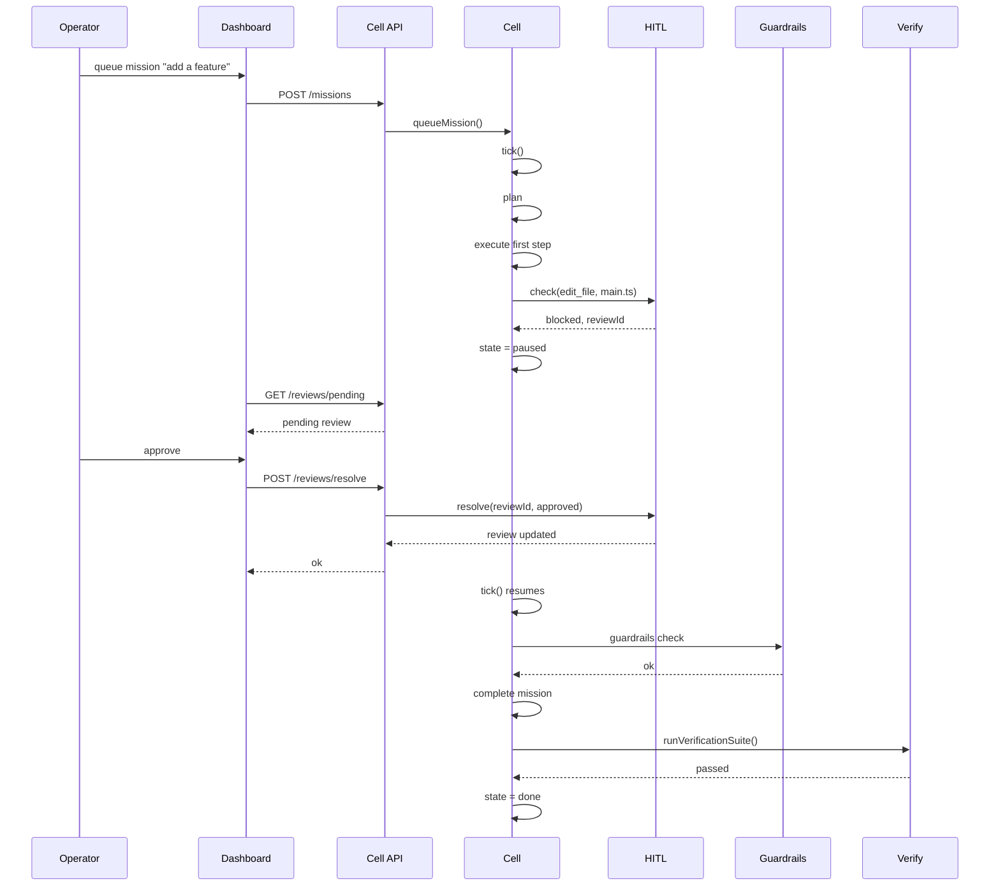
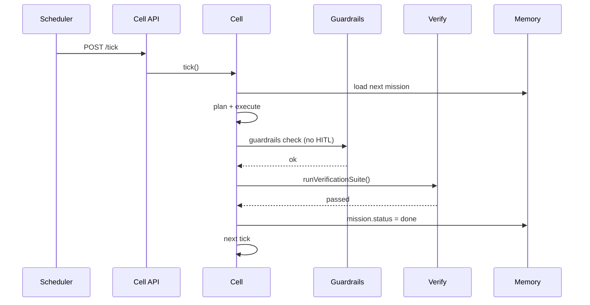

# Factory Modes: Lit vs Dark

This course is not just about building a long-running agent. It is about building a **software factory**: a system where many harnessed loops pick work from a queue, execute it, verify it, and ship it.

Addy Osmani describes this idea in ["Software Factories, Light and Dark"](https://addyosmani.com/blog/software-factories/). This document maps that idea to the cell you are building and shows how to run it in either **lit** or **dark** mode.

> **One sentence summary:** A lit factory keeps humans in the loop. A dark factory removes them. The cell supports both, but it defaults to lit because verification — not generation — is the real bottleneck.

---

## 1. What is a software factory?

A software factory has three layers:

1. **The loop** — one agent doing one job on repeat: gather context, act, check the result, go again.
2. **The harness** — the sandbox, tools, durable memory, and gates that make the loop safe.
3. **The factory** — many harnessed loops fed by a queue and drained through a review gate into production.

In our code:

| Layer | File |
|-------|------|
| Loop | `cell/src/loop-engine.ts` |
| Harness | `cell/src/guardrails.ts`, `cell/src/hitl.ts`, `cell/src/budget.ts`, `cell/src/git-memory.ts` |
| Factory | `cell/src/lead.ts`, `cell/src/coordinator.ts`, `cell/src/scheduler.ts`, `cell/src/orchestrator.ts` |

The bottleneck in any factory is not how fast you can generate code. It is how fast you can **verify** it. That is why the cell spends so much effort on the verification gate, the execution journal, and the evaluation harness.

---

## 2. Lit factory: humans own the outer loop

A lit factory is the default mode of the cell. Agents do most of the building, but a human reads what comes out before it ships. Human judgment lives at the expensive, non-scalable review gate.

### How the cell stays lit by default

- **Human-in-the-loop (`cell/src/hitl.ts`)** pauses the cell when an action touches protected files, uses dangerous tools, or matches risky keywords.
- **Guardrails (`cell/src/guardrails.ts`)** block prompt injection, unsafe shell commands, path traversal, unapproved destructive actions, and unexpected network egress.
- **Verification gate (`cell/src/verify.ts`)** runs lint, build, and tests before any mission is marked done.
- **Budget tracker (`cell/src/budget.ts`)** stops the cell after token, cost, or time limits.
- **Git memory (`cell/src/git-memory.ts`)** writes every state change to disk so a crash mid-review does not lose the question.

### Default lit configuration

The cell starts in lit mode with this configuration in `cell/src/main.ts`:

```ts
const cell = new Cell({
  basePath,
  verificationCommands,
  maxRetries: 3,
  budget,
  observability,
  // hitl is omitted, so a default HumanInTheLoop is created
  // guardrails default to requiring approval for destructive actions
});
```

If you want to be explicit, you can pass a strict `HumanInTheLoop`:

```ts
import { HumanInTheLoop } from './hitl.js';

const cell = new Cell({
  basePath,
  verificationCommands,
  maxRetries: 3,
  hitl: new HumanInTheLoop({
    basePath,
    requireApprovalForTools: ['delete_file', 'edit_file'],
    requireApprovalForInput: ['rm ', 'remove ', 'drop table', 'deploy'],
    requireApprovalForProtectedFiles: true,
    protectedPatterns: ['main.ts', 'package.json', 'README.md', '.env'],
  }),
});
```

In this mode:

- The cell plans, reads, edits, and verifies.
- High-impact actions pause and wait for a human verdict.
- The dashboard shows pending reviews under `/reviews/pending`.
- Nothing ships until a person says yes or the action is pre-approved.

### When to use lit mode

Use lit mode when:

- The codebase matters and you must keep understanding it.
- You are learning how the cell works.
- You are working in production or with customer data.
- You want to prevent comprehension debt from growing.

---

## 3. Dark factory: the lights are off

A dark factory removes human reading from the pipeline. The cell scopes, builds, and ships code verified only by machines. It is faster, but every automated change adds to **comprehension debt**: the gap between how much code exists and how much any human still understands.

The cell can run in dark mode because all the safety layers are configurable. You simply turn off the gates that require human judgment.

### How to configure dark mode

There is no single `DARK_MODE=true` flag. Instead, you relax each gate:

#### 1. Disable human-in-the-loop

Create a `HumanInTheLoop` that never blocks:

```ts
// cell/src/config.ts or a setup script
import { HumanInTheLoop } from './hitl.js';

export const darkFactoryHITL = new HumanInTheLoop({
  basePath: process.cwd(),
  requireApprovalForTools: [],
  requireApprovalForInput: [],
  requireApprovalForProtectedFiles: false,
  protectedPatterns: [],
});
```

Then pass it to the cell:

```ts
const cell = new Cell({
  basePath,
  verificationCommands,
  maxRetries: 3,
  hitl: darkFactoryHITL,
});
```

Now no action will pause for human review.

#### 2. Auto-approve destructive actions in guardrails

```ts
import { Guardrails } from './guardrails.js';

const permissiveGuardrails = new Guardrails({
  workspacePath: basePath,
  defaultAllowList: ['npm', 'node', 'echo', 'ls', 'rm', 'mv', 'git'],
  requireApprovalForDestructive: false,
  approvedDestructive: new Set<string>(), // not used when requirement is off
});
```

This allows `rm`, `mv`, and broad shell commands inside the workspace. It still blocks path traversal and prompt injection.

#### 3. Widen the shell allow-list

The default `ShellTool` only runs commands on an allow-list. In dark mode you may allow more:

```ts
const cell = new Cell({
  basePath,
  verificationCommands,
  maxRetries: 3,
  shellAllowList: ['npm', 'node', 'git', 'rm', 'mv', 'cp', 'ls', 'echo'],
});
```

Be careful: `rm` and `mv` are destructive. The cell can now delete files without asking.

#### 4. Auto-run the cell

The `AUTO_TICK` and `AUTO_SCHEDULE` environment variables already exist in `cell/src/main.ts`:

```bash
AUTO_TICK=true npm run dev
```

This starts a loop that calls `cell.tick()` every 5 seconds. Combined with a scheduler:

```bash
AUTO_TICK=true AUTO_SCHEDULE=true npm run dev
```

The cell will continuously pull scheduled work, execute missions, and verify them without a human present.

#### 5. Use an LLM for planning and reasoning

A dark factory benefits from LLM-backed autonomy. Set the provider in the environment:

```bash
LLM_PROVIDER=openai
LLM_API_KEY=sk-...
LLM_MODEL=gpt-4o-mini
AUTO_TICK=true
AUTO_SCHEDULE=true
npm run dev
```

The `Planner`, `Reasoner`, and `LeadEngineer` will use the LLM. If the LLM response cannot be parsed, the rule-based fallback still runs.

### Full dark-factory example

Here is a self-contained dark-mode bootstrap:

```ts
// cell/src/dark-mode.ts (example file, not in the default build)
import { Cell } from './cell.js';
import { startServer } from './server.js';
import { BudgetTracker } from './budget.js';
import { Observability } from './observability.js';
import { HumanInTheLoop } from './hitl.js';
import { Guardrails, guardTools } from './guardrails.js';
import {
  ShellTool,
  ReadFileTool,
  EditFileTool,
  VerifyTool,
  ToolRegistryImpl,
} from './tools.js';

const basePath = process.cwd();
const verificationCommands: [string, string[]][] = [
  ['npm', ['run', 'lint']],
  ['npm', ['run', 'build']],
  ['npm', ['test']],
];

const observability = new Observability({ basePath });

const guardrails = new Guardrails({
  workspacePath: basePath,
  defaultAllowList: ['npm', 'node', 'git', 'rm', 'mv', 'cp', 'ls', 'echo'],
  requireApprovalForDestructive: false,
});

const tools = guardTools(
  [
    new ShellTool({ allowList: ['npm', 'node', 'git', 'rm', 'mv', 'cp', 'ls', 'echo'] }),
    new ReadFileTool(basePath),
    new EditFileTool(basePath),
    new VerifyTool(verificationCommands),
  ],
  guardrails
);

const cell = new Cell({
  basePath,
  verificationCommands,
  maxRetries: 5,
  tools,
  shellAllowList: ['npm', 'node', 'git', 'rm', 'mv', 'cp', 'ls', 'echo'],
  hitl: new HumanInTheLoop({
    basePath,
    requireApprovalForTools: [],
    requireApprovalForInput: [],
    requireApprovalForProtectedFiles: false,
    protectedPatterns: [],
  }),
  budget: new BudgetTracker({
    basePath,
    tokenLimit: Number(process.env.CELL_TOKEN_LIMIT ?? '0'),
    costLimit: Number(process.env.CELL_COST_LIMIT ?? '0'),
    elapsedMsLimit: Number(process.env.CELL_RUNTIME_LIMIT_MS ?? '0'),
  }),
  observability,
});

startServer(cell, 3456);
```

> **Warning:** This example removes most human gates. Run it only inside a container, a disposable clone, or a sandbox repository.

### When to use dark mode

Use dark mode only when:

- The work is low-stakes, repetitive, and easy to verify mechanically.
- You have strong automated tests, lint rules, and branch protection.
- You can afford to throw away the workspace and recreate it.
- You accept that comprehension debt will grow and plan to pay it down later.

---

## 4. The spectrum: not just two modes

Most real systems live between fully lit and fully dark. You can mix settings:

| Setting | Lit value | Dark value |
|---------|-----------|------------|
| `requireApprovalForTools` | `['delete_file', 'edit_file']` | `[]` |
| `requireApprovalForProtectedFiles` | `true` | `false` |
| `requireApprovalForDestructive` | `true` | `false` |
| Shell allow-list | `['npm', 'node', 'ls']` | `['npm', 'node', 'git', 'rm', 'mv', 'cp']` |
| `AUTO_TICK` | `false` | `true` |
| `AUTO_SCHEDULE` | `false` | `true` |
| `LLM_PROVIDER` | `none` or `ollama` | `openai` |

You might start lit while learning, then allow `edit_file` automatically but still require approval for `delete_file`. That is a partially-lit factory.

---

## 5. Verification is the bottleneck

Addy Osmani's central point is that **verification, not generation, limits autonomy**. The cell is designed around that idea:

- The verification suite runs after every plan execution.
- The reflector decides whether to retry or escalate based on verification results.
- The evaluation harness measures how often verification passes over time.
- Verification traces record every attempt so you can spot flakiness.

In a dark factory, verification is the only gate. If your tests are weak, the factory will ship broken code quickly. If your tests are strong, the factory can move fast without losing correctness.

### Back pressure rule

> You can only hand the cell as much autonomy as you can cheaply and reliably verify, and not one inch more.

If the cell keeps failing verification, do not widen the guardrails. Improve the tests, the prompts, or the tooling. Otherwise you are just generating more unverified work.

---

## 6. Comprehension debt

Comprehension debt is the gap between how much code exists and how much any human understands. A dark factory increases it. A lit factory keeps it in check.

The cell has features to fight comprehension debt even in dark mode:

- **Git memory** keeps a durable history of every mission, plan, decision, and failure.
- **Retrieval** (`cell/src/retrieval.ts`) surfaces relevant past decisions when planning.
- **Summaries** (`cell/src/summary.ts`) compress long histories into readable context.
- **Failure memory** (`cell/src/git-memory.ts` `FailureMemory`) records classified failures so the cell learns.
- **Evaluation harness** (`cell/src/eval.ts`) measures whether the cell is improving.

Even in dark mode, schedule regular human reviews. The dashboard makes this easy: look at `/runs`, `/failures`, and `/traces` to see what the factory did while you were away.

---

## 7. Sequence diagram: lit mission



## 8. Sequence diagram: dark mission



No human appears in the second diagram. The only gate is verification.

---

## 9. Practical recommendations

1. **Start lit.** Use the defaults. Read the dashboard reviews. Learn what the cell does.
2. **Strengthen verification before darkening.** Add tests, lint rules, and type checks. The stronger the verification, the safer dark mode becomes.
3. **Open one gate at a time.** First allow `edit_file` automatically. Then allow a wider shell list. Only remove destructive approval after you have seen the cell behave well for many missions.
4. **Use budgets in dark mode.** Set `CELL_TOKEN_LIMIT`, `CELL_COST_LIMIT`, or `CELL_RUNTIME_LIMIT_MS` so the factory cannot run forever.
5. **Review memory regularly.** Even in dark mode, read `state/memory.json`, `/runs`, `/failures`, and `/traces` at least once per day.
6. **Keep dark mode in a container or a clone.** Never point an unrestricted dark factory at your only copy of important code.

---

## 10. Further reading

- `docs/ARCHITECTURE.md` — the overall system architecture.
- `docs/SEQUENCE_DIAGRAMS.md` — all flows in one place.
- `docs/DESIGN_PATTERNS.md` — how patterns like Observer, Repository, and Strategy keep the factory modular.
- `docs/CODEBASE_GUIDE.md` — a junior-dev walkthrough of the code.
- `docs/CHAPTER_CROSS_REFERENCE.md` — which chapters cover HITL, guardrails, scheduling, and orchestration.
- Addy Osmani, ["Software Factories, Light and Dark"](https://addyosmani.com/blog/software-factories/)
- Dex Horthy, ["Harness Engineering is not Enough: Why Software Factories Fail"](https://youtu.be/htM02KMNZnk?t=27219)
