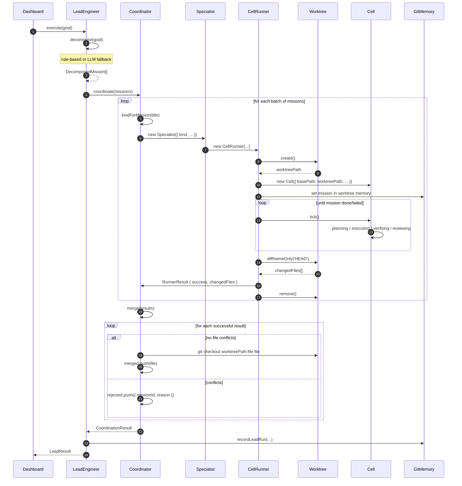
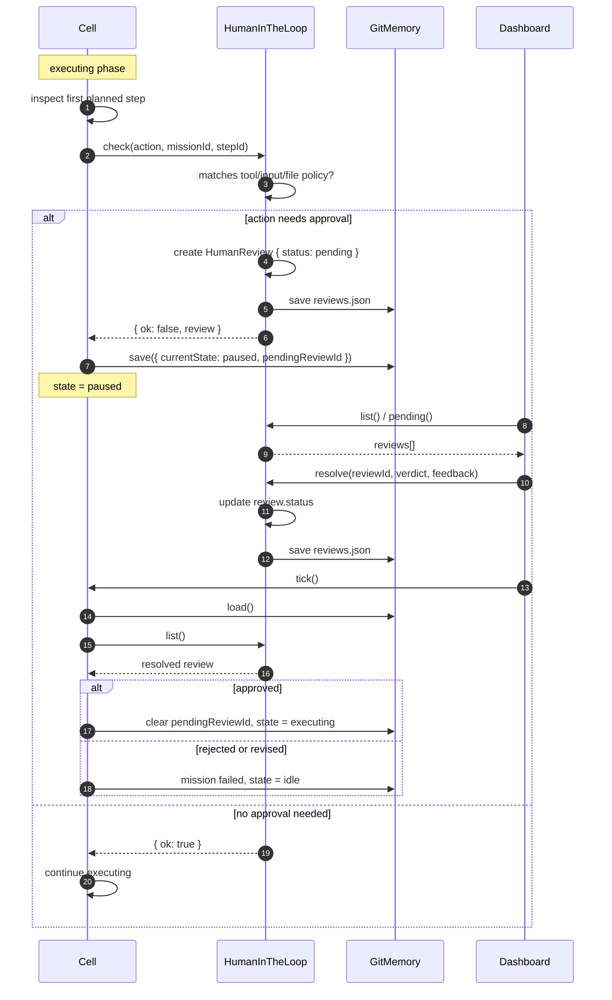
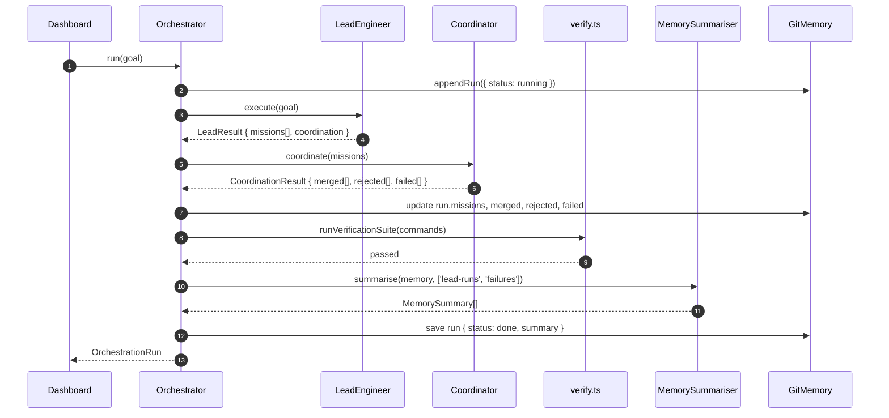
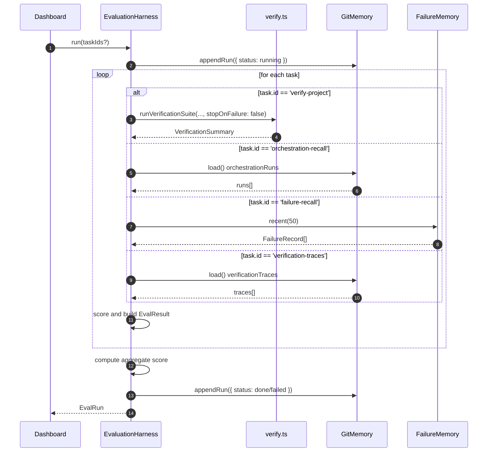
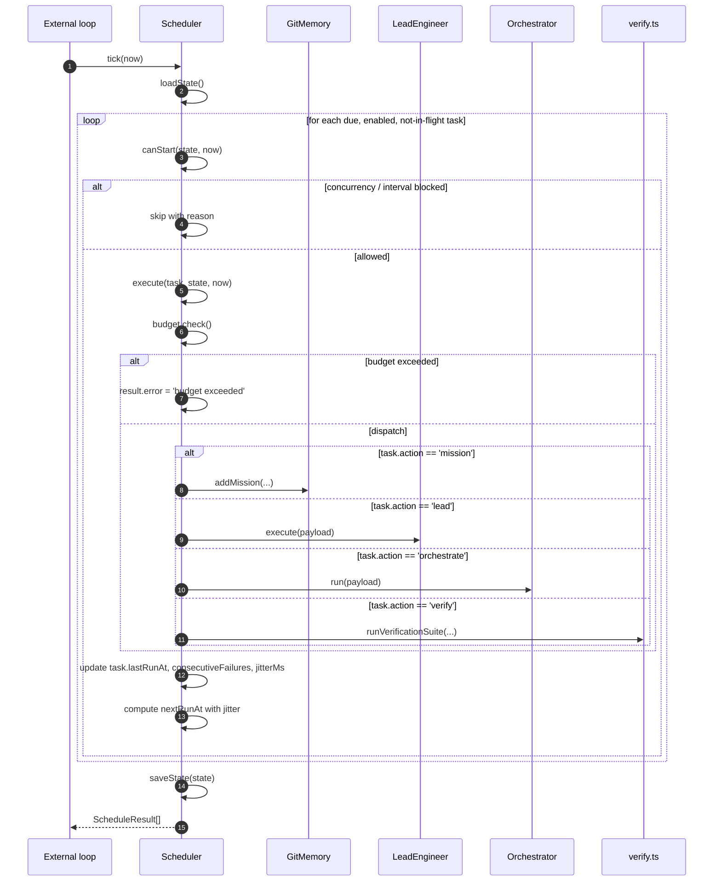

# Sequence Diagrams

This file shows the major flows in the long-running cell as Mermaid sequence diagrams. Each diagram is meant for a junior developer: it uses real file and function names from the codebase and explains what is happening in plain language.

> **Key idea:** A sequence diagram is like reading a comic strip from top to bottom. Each vertical line is a participant. Each horizontal arrow is a message or action. Time moves downward.

---

## 1. Full Mission Lifecycle

This is the happiest path: a mission is queued, planned, executed, verified, reviewed, and marked done.

Participants:

- **Operator / Dashboard** — the human or UI that starts things.
- **Cell** (`cell/src/cell.ts`) — the durable state machine.
- **GitMemory** (`cell/src/git-memory.ts`) — writes `state/memory.json` and commits it.
- **ExecutionJournal** (`cell/src/journal.ts`) — appends phase runs.
- **LoopEngine** (`cell/src/loop-engine.ts`) — runs the ReAct inner loop.
- **verify.ts** — runs the verification gate.

```mermaid
sequenceDiagram
    autonumber
    participant Op as Operator/Dashboard
    participant Cell as Cell (cell.ts)
    participant Mem as GitMemory
    participant Journal as ExecutionJournal
    participant Loop as LoopEngine
    participant Ver as verify.ts

    Op->>Cell: queueMission(title, description)
    Cell->>Mem: addMission(...)
    Mem-->>Cell: Mission { id, status: backlog }
    Note over Cell,Mem: Mission is stored; cell is still idle.

    Op->>Cell: tick()
    Cell->>Mem: load()
    Mem-->>Cell: CellMemory { currentState: idle }
    Cell->>Cell: find next backlog mission
    Cell->>Mem: save({ currentState: planning, currentMissionId })
    Note over Cell: state = planning

    Cell->>Journal: start(missionId, 'planning')
    Cell->>Cell: planner.plan(...)
    Cell->>Mem: recordDecision(...)
    Cell->>Mem: logProgress(...)
    Cell->>Journal: finish(runId, 'success')
    Cell->>Mem: save({ currentState: executing })
    Note over Cell: state = executing

    Cell->>Journal: start(missionId, 'executing')
    Cell->>Loop: run(missionId, task, ...)
    Loop-->>Cell: LoopResult { success: true }
    Cell->>Mem: logProgress(...)
    Cell->>Journal: finish(runId, 'success')
    Cell->>Mem: save({ currentState: verifying })
    Note over Cell: state = verifying

    Cell->>Journal: start(missionId, 'verifying')
    Cell->>Ver: runVerificationSuite(commands)
    Ver-->>Cell: VerificationSummary { passed: true }
    Cell->>Mem: recordVerificationTrace(...)
    Cell->>Journal: finish(runId, 'success')
    Cell->>Mem: save({ currentState: reviewing })
    Note over Cell: state = reviewing

    Cell->>Journal: start(missionId, 'reviewing')
    Cell->>Cell: review / close out
    Cell->>Mem: mark mission done, metrics.missionsCompleted++
    Cell->>Journal: finish(runId, 'success')
    Cell->>Mem: save({ currentState: idle, currentMissionId: undefined })
    Note over Cell: state = idle, ready for next mission
```

**What to notice:** The cell saves memory before and after every phase. If the power goes out at step 13, the next process reads `currentState: verifying` and picks up from there.

---

## 2. ReAct Inner Loop

Inside the `executing` phase, `LoopEngine` repeatedly plans, reasons, acts, observes, reflects, and verifies.

Participants:

- **LoopEngine** (`cell/src/loop-engine.ts`)
- **Planner** (`cell/src/planner.ts`)
- **Reasoner** (`cell/src/reasoner.ts`)
- **Actor** (`cell/src/actor.ts`)
- **Observer** (`cell/src/observer.ts`)
- **Reflector** (`cell/src/reflector.ts`)
- **verify.ts**

```mermaid
sequenceDiagram
    autonumber
    participant Loop as LoopEngine
    participant Plan as Planner
    participant Reason as Reasoner
    participant Actor as Actor
    participant Obs as Observer
    participant Refl as Reflector
    participant Ver as verify.ts

    Loop->>Loop: start iteration
    Loop->>Plan: plan(missionId, task, retrievalContext)
    Plan-->>Loop: Plan { steps[] }

    Loop->>Reason: reason(plan, priorThought, priorObservation, context)
    Reason-->>Loop: Thought { text, action }

    Loop->>Actor: act(action)
    Actor->>Actor: registry.byName(tool).execute(input)
    Actor-->>Loop: rawOutput

    Loop->>Obs: observe(action, rawOutput)
    Obs-->>Loop: Observation { success, note }

    Loop->>Ver: runVerificationSuite(...)
    Ver-->>Loop: VerificationSummary

    Loop->>Refl: reflect(observation, verification, attempt)
    Refl-->>Loop: Reflection { verdict: finish | continue | escalate }

    alt verification passed && verdict == finish
        Loop-->>Loop: return LoopResult { success: true }
    else verdict == escalate
        Loop-->>Loop: return LoopResult { success: false }
    else continue
        Loop->>Loop: accumulate failure context
        Loop->>Loop: next iteration
    end
```

**What to notice:** The loop keeps going until either verification passes and the reflector says `finish`, or it runs out of attempts and escalates. The `Cell` can pass an `onCheckpoint` callback so the outer cell saves the inner loop's state after every attempt.

---

## 3. LeadEngineer → Coordinator → Specialists

A high-level goal is decomposed into missions, run in isolated worktrees, and merged.

Participants:

- **Dashboard**
- **LeadEngineer** (`cell/src/lead.ts`)
- **Coordinator** (`cell/src/coordinator.ts`)
- **Specialist** (`cell/src/specialist.ts`)
- **CellRunner** (`cell/src/runner.ts`)
- **Worktree** (`cell/src/worktree.ts`)
- **Cell** (`cell/src/cell.ts`)
- **GitMemory**



**What to notice:** Each mission gets its own Git worktree, so specialists cannot accidentally stomp on each other's files. The coordinator resolves file-level conflicts before merging.

---

## 4. Human-in-the-Loop

Before a destructive or protected action runs, the cell pauses and asks a human.

Participants:

- **Cell** (`cell/src/cell.ts`)
- **HumanInTheLoop** (`cell/src/hitl.ts`)
- **GitMemory**
- **Dashboard / Operator**



**What to notice:** The cell checks for a `pendingReviewId` at the **very start** of `tick()`, before any state dispatch. That means a restart after a crash will not skip a pending human question.

---

## 5. Orchestrator End-to-End

The capstone flow: one goal becomes many missions, then a final verification gate, then a summary.

Participants:

- **Dashboard**
- **Orchestrator** (`cell/src/orchestrator.ts`)
- **LeadEngineer**
- **Coordinator**
- **verify.ts**
- **MemorySummariser** (`cell/src/summary.ts`)
- **GitMemory**



**What to notice:** The orchestrator keeps appending run snapshots to memory as it progresses. If it fails at step 7, the run is already partially recorded with the missions that completed.

---

## 6. Evaluation Harness

The harness measures the cell with repeatable benchmark tasks.

Participants:

- **Dashboard**
- **EvaluationHarness** (`cell/src/eval.ts`)
- **verify.ts**
- **GitMemory / FailureMemory**



**What to notice:** The harness always runs every task, even after one fails, so the report is complete. It also detects regressions and flaky missions by looking at `verificationTraces`.

---

## 7. Scheduler Tick

The scheduler is an external loop that checks cron tasks and fires the right action.

Participants:

- **External loop** (cron, setInterval, or `AUTO_SCHEDULE=true` in `cell/src/main.ts`)
- **Scheduler** (`cell/src/scheduler.ts`)
- **GitMemory**
- **LeadEngineer / Orchestrator / verify.ts**



**What to notice:** The scheduler does not keep its own timer by default. Something else (a cron job, `startSchedulerLoop`, or `AUTO_SCHEDULE=true`) calls `tick()`. This makes the scheduler deterministic and easy to unit test.

---

## How to read these diagrams

- **Solid arrows (`->>`)** are synchronous calls or requests.
- **Dashed arrows (`-->>`)** are returns or responses.
- **Rectangles labeled `alt`/`else`/`end`** show branches in the flow.
- **Rectangles labeled `loop`** show repeated steps.
- **Notes (`Note over ...`)** add context without changing the flow.
